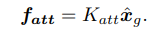
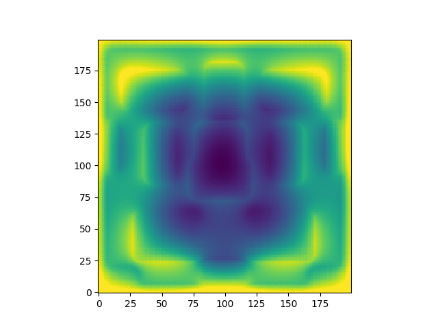
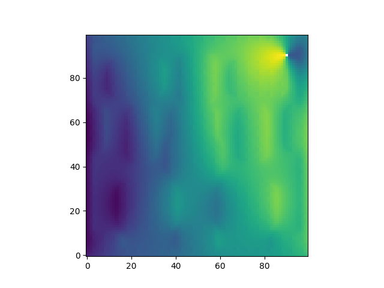
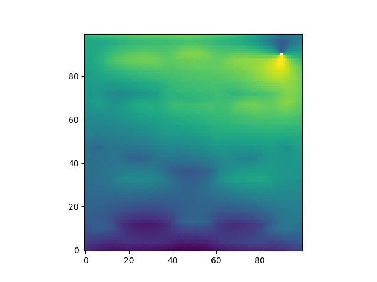

.. DE3 Robotics Coursework documentation master file, created by
   sphinx-quickstart on Wed Jan 27 19:02:39 2021.
   You can adapt this file completely to your liking, but it should at least
   contain the root `toctree` directive.

.. toctree::
   :maxdepth: 2
   :caption: Contents:

==========================================================
Welcome to DE3 Robotics Group 1 Coursework 2 Documentation
==========================================================

We (Shafae Ali, Oscar Jones, Oscar Leclercq, Oliver Veal) have decided to create a readthedocs page for our coursework submissions instead of a Google Drive or Word document. This way this documentation can be used for teaching ROS at any point in the future, as well as have integrated code blocks and interactive videos.
For the purpose of archiving the document, we will be submitting in PDF and HTML formats.

.. warning::

    For a more interactive experience, please use the web_ version instead of the PDF. Thanks!

.. _web: https://robotics-coursework-de3.readthedocs.io/en/latest/#

=====
Setup
=====

Open Terminator to input commands and run different services or files.

==================
C-Space Map
==================

----------------------------------------
Task Ai : C-Space Dilation, Square Mask
----------------------------------------

This task initialises the Denavit-Hartenberg, D-H, table.
The table contains all the necessary information to orientate each link of the robot in a consistent manner so that the position of each link can be found relative to the other.
As the robot moves, the D-H table is updated.
The D-H table is a convenient way to store this information as the transformation matrix for each link can be evaluated using the corresponding row in the table.

-------------------------------------------
Task Aii : C-Space Dilation, Circular Mask
-------------------------------------------

To make the D-H table, the reference

====================
Waypoint Navigation
====================

----------------------------------------------------
Task Bi: Adding Waypoints by Hand, Creating the Path
----------------------------------------------------

This task initialises the Denavit-Hartenberg, D-H, table.
The table contains all the necessary information to orientate each link of the robot in a consistent manner so that the position of each link can be found relative to the other.
As the robot moves, the D-H table is updated.
The D-H table is a convenient way to store this information as the transformation matrix for each link can be evaluated using the corresponding row in the table.

-------------------------------------------------------------
Task Bii: Adding Waypoints by Hand, Shortest Path Calculation
-------------------------------------------------------------

This task initialises the Denavit-Hartenberg, D-H, table.

==========================
Potential Field Algorithm
==========================

---------------------------------------------------------------------------
Task Ci: General Implementation of the Potential Field Algorithm
---------------------------------------------------------------------------

Analytical Derivation of Positive Force
---------------------------------------

To complete the code, we can compare the definitions of the forces to the equations given for those forces in the code.

.. code-block:: python
   :linenos:
   :emphasize-lines: 10,12,15

   # compute the positive force attracting the robot towards the goal
   # vector to goal position from DE NIRO
   goal_vector = goal - deniro_position
   # distance to goal position from DE NIRO
   distance_to_goal = np.linalg.norm(goal_vector)
   # unit vector in direction of goal from DE NIRO
   pos_force_direction = goal_vector / distance_to_goal
      
   # potential function
   pos_force_magnitude =     # your code here!
   # tuning parameter
   K_att =      # tune this parameter to achieve desired results
      
   # positive force
   positive_force = K_att * pos_force_direction * pos_force_magnitude  # normalised positive force

*Fig x: Definition for force of attraction*

Line 15 in the above code corresponds to equation x. We can compare the terms to the variables to deduce the definition of ``pos_force_magnitude`` which needs to be completed.

+--------+---------------------------+-----------------------------+
| Term   | Variable                  | Description                 |
+========+===========================+=============================+
| fatt   | ``positive_force``        | force in x and y components |
+--------+---------------------------+-----------------------------+
| K_att  | ``K_att``                 | constant coefficient        |
+--------+---------------------------+-----------------------------+
| Xg     | ``pos_force_direction``   | unit vector in x and y      |
+--------+---------------------------+-----------------------------+
| _      | ``pos_force_magnitude``   | scalar magnitude            |
+--------+---------------------------+-----------------------------+

Upon inspection, we can see that ``pos_force_magnitude`` must equal 1 for the given equation and that in the code to match.
This makes the positive force directly proportional to the direction to the goal, unaffected by distance.
``K_att`` in line 12 is the constant that will need tuning.

Analytical Derivation of Positive Force
---------------------------------------

A similar method to above can be used for the negative force.

.. code-block:: python
   :linenos:
   :emphasize-lines: 16,18,23

   # compute the negative force repelling the robot away from the obstacles
   obstacle_pixel_locations = np.argwhere(self.pixel_map == 1)
   # coordinates of every obstacle pixel
   obstacle_pixel_coordinates = np.array([obstacle_pixel_locations[:, 1], obstacle_pixel_locations[:, 0]]).T
   # coordinates of every obstacle pixel converted to world coordinates
   obstacle_positions = self.world_position(obstacle_pixel_coordinates)
      
   # vector to each obstacle from DE NIRO
   obstacle_vector = obstacle_positions - deniro_position   # vector from DE NIRO to obstacle
   # distance to obstacle from DE NIRO
   distance_to_obstacle = np.linalg.norm(obstacle_vector, axis=1).reshape((-1, 1))  # magnitude of vector
   # unit vector in direction of obstacle from DE NIRO
   force_direction = obstacle_vector / distance_to_obstacle   # normalised vector (for direction)
      
   # potential function
   force_magnitude =   # your code here!
   # tuning parameter
   K_rep =   # tune this parameter to achieve desired results
      
   # force from an individual obstacle pixel
   obstacle_force = force_direction * force_magnitude
   # total negative force on DE NIRO
   negative_force = K_rep * np.sum(obstacle_force, axis=0) / obstacle_pixel_locations.shape[0]

.. image:: img/f_rep_eq.png
   :width: 200
   :alt: Robot Diagram

*Fig x: Equation for force of repulsion*

Line 23 defines the negative force.

+--------------+-----------------------------------------+--------------------------------------------------------------------------+
| Term         | Variable                                | Description                                                              |
+==============+=========================================+==========================================================================+
| frep         | ``negative_force``                      | force in x and y components                                              |
+--------------+-----------------------------------------+--------------------------------------------------------------------------+
| K_rep        | ``K_rep``                               | constant coefficient                                                     |
+--------------+-----------------------------------------+--------------------------------------------------------------------------+
| 1/N          | ``/ obstacle_pixel_locations.shape[0]`` | constant, 1 over number of obstacle pixels summed to normalise magnitude |
+--------------+-----------------------------------------+--------------------------------------------------------------------------+
| Sigma(xi/di) | ``np.sum(obstacle_force, axis=0)``      | scalar magnitude                                                         |
+--------------+-----------------------------------------+--------------------------------------------------------------------------+
| xi/di        | ``obstacle_force``                      | unit vector in x and y                                                   |
+--------------+-----------------------------------------+--------------------------------------------------------------------------+

We can see that xi/di in the equation is stored in ``obstacle_force`` in the code. ``obstacle_force`` is defined in the line above as ``force_direction * force_magnitude``.

If xi is defined as “the unit vector from the robot to obstacle”, then 1/di must be ``force_magnitude``. Given that di is defined as “the distance from the roboto to the obstacle”, this means in the ``force_magnitude`` definition, we should use ``1 / distance_to_obstacle``.

This makes the negative force inversely proportional to the distance from the robot to the sum of each obstacle pixel

Implementation
--------------

Running the code with the initial coefficients led deniro to crash into the table ahead.
To gain a better understanding of the influence of the potential field forces, we implemented different visualisation methods and chose the most useful to help iterate the paramters.
These methods began with making a clone of the “potential” function. Instead of using deniro’s position to calculate its own direction vector and returning an updated position, the function was nested inside for loops to iterate over every location in the room.
For each location, the vector direction was calculated.
This allows us to see at each location how deniro would react, and plot his expected path from the goal (sum of positive and negative forces).

Heat Map
--------

Our first idea was to plot heat maps of the forces experienced. This method was useful as a proof of concept, however there were some limitations when collapsing down the data to 3D (x, y, colour value).
This meant only one metric could be plotted.
Plotting magnitude of force shows relative strength but loses direction and positive / negative sign, but does give an idea of whether the edges are detected or whether deniro would run into obstacles.

The magnitude could be split into x and y components and plotted separately, which also allows positive and negative values to be seen.
By superposing the graphs in your head, you can see in which x and y directions deniro would be pushed, gaining more understanding, however this is still not optimal.

Vector Fields
-------------
A vector field plot was then considered. This plot, known in pyplot as a “quiver”, plots vectors on a map at discrete intervals. This shows the direction of the force and magnitude, and allows us to see much more clearly how deniro would be driven at each point in the map.

---------------------------------------------------------------------------
Task Cii: Implementing the Potential Field Algorithm, Custom Implementation
---------------------------------------------------------------------------

This task initialises the Denavit-Hartenberg, D-H, table.

==========================
Probabilistic Road Map
==========================

---------------------------------------------------
Task Di: Randomly Sampling from the Map
---------------------------------------------------

This task initialises the Denavit-Hartenberg, D-H, table.
The table contains all the necessary information to orientate each link of the robot in a consistent manner so that the position of each link can be found relative to the other.
As the robot moves, the D-H table is updated.
The D-H table is a convenient way to store this information as the transformation matrix for each link can be evaluated using the corresponding row in the table.

---------------------------------
Task Dii: Harris Corner Detection
---------------------------------

This task initialises the Denavit-Hartenberg, D-H, table.

-----------------------------------------------------------------
Task Ei: Creating the Graph, Tuning Distances for Creating Edges
-----------------------------------------------------------------

This task initialises the Denavit-Hartenberg, D-H, table.

---------------------------------------------------------
Task Eii: Creating the Graph, Tuning Edge Collision Check
---------------------------------------------------------

This task initialises the Denavit-Hartenberg, D-H, table.

-------------------------------------------------------------
Task Eiii: Creating the Graph, Completing an Incomplete Graph
-------------------------------------------------------------

This task initialises the Denavit-Hartenberg, D-H, table.

------------------------------------------------
Task Fi: Dijkstra's Algorithm, Creating the Path
------------------------------------------------

This task initialises the Denavit-Hartenberg, D-H, table.
The table contains all the necessary information to orientate each link of the robot in a consistent manner so that the position of each link can be found relative to the other.
As the robot moves, the D-H table is updated.
The D-H table is a convenient way to store this information as the transformation matrix for each link can be evaluated using the corresponding row in the table.

----------------------------------------------------
Task Fii: Dijkstra's Algorithm, Planning Algorithms
----------------------------------------------------

This task initialises the Denavit-Hartenberg, D-H, table.
The table contains all the necessary information to orientate each link of the robot in a consistent manner so that the position of each link can be found relative to the other.
As the robot moves, the D-H table is updated.
The D-H table is a convenient way to store this information as the transformation matrix for each link can be evaluated using the corresponding row in the table.