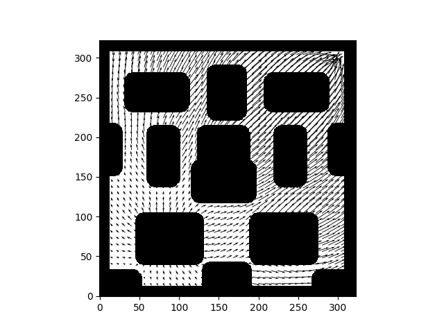
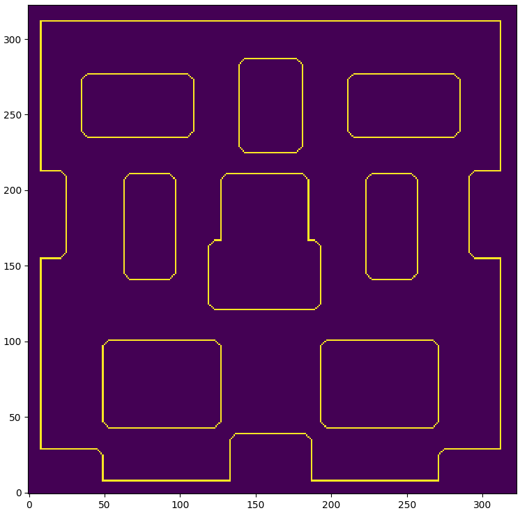
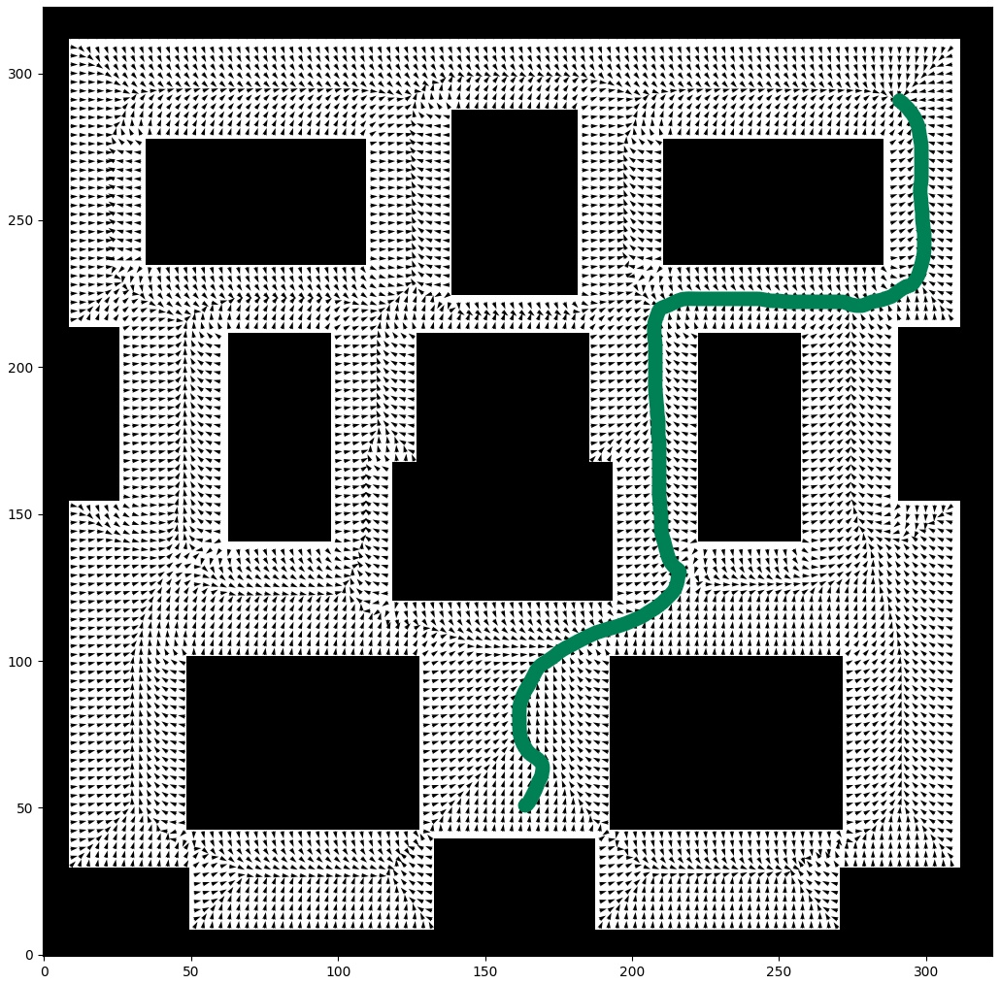

.. DE3 Robotics Coursework documentation master file, created by
   sphinx-quickstart on Wed Jan 27 19:02:39 2021.
   You can adapt this file completely to your liking, but it should at least
   contain the root `toctree` directive.

.. toctree::
   :maxdepth: 2
   :caption: Contents:

==========================================================
Welcome to DE3 Robotics Group 1 Coursework 2 Documentation
==========================================================

We (Shafae Ali, Oscar Jones, Oscar Leclercq, Oliver Veal) have decided to create a readthedocs page for our coursework submissions instead of a Google Drive or Word document. This way this documentation can be used for teaching ROS at any point in the future, as well as have integrated code blocks and interactive videos.
For the purpose of archiving the document, we will be submitting in PDF and HTML formats.

.. warning::

    For a more interactive experience, please use the web_ version instead of the PDF. Thanks!

.. _web: https://robotics-coursework-de3.readthedocs.io/en/latest/#

=====
Setup
=====

Open Terminator to input commands and run different services or files.

==================
C-Space Map
==================

----------------------------------------
Task Ai : C-Space Dilation, Square Mask
----------------------------------------

This task initialises the Denavit-Hartenberg, D-H, table.
The table contains all the necessary information to orientate each link of the robot in a consistent manner so that the position of each link can be found relative to the other.
As the robot moves, the D-H table is updated.
The D-H table is a convenient way to store this information as the transformation matrix for each link can be evaluated using the corresponding row in the table.

-------------------------------------------
Task Aii : C-Space Dilation, Circular Mask
-------------------------------------------

To make the D-H table, the reference

====================
Waypoint Navigation
====================

----------------------------------------------------
Task Bi: Adding Waypoints by Hand, Creating the Path
----------------------------------------------------

This task initialises the Denavit-Hartenberg, D-H, table.
The table contains all the necessary information to orientate each link of the robot in a consistent manner so that the position of each link can be found relative to the other.
As the robot moves, the D-H table is updated.
The D-H table is a convenient way to store this information as the transformation matrix for each link can be evaluated using the corresponding row in the table.

-------------------------------------------------------------
Task Bii: Adding Waypoints by Hand, Shortest Path Calculation
-------------------------------------------------------------

This task initialises the Denavit-Hartenberg, D-H, table.

==========================
Potential Field Algorithm
==========================

---------------------------------------------------------------------------
Task Ci: General Implementation of the Potential Field Algorithm
---------------------------------------------------------------------------

Analytical Derivation of Positive Force
---------------------------------------

To complete the code, we can compare the definitions of the forces to the equations given for those forces in the code.

.. code-block:: python
   :linenos:
   :emphasize-lines: 10,12,15

   # compute the positive force attracting the robot towards the goal
   # vector to goal position from DE NIRO
   goal_vector = goal - deniro_position
   # distance to goal position from DE NIRO
   distance_to_goal = np.linalg.norm(goal_vector)
   # unit vector in direction of goal from DE NIRO
   pos_force_direction = goal_vector / distance_to_goal
      
   # potential function
   pos_force_magnitude =     # your code here!
   # tuning parameter
   K_att =      # tune this parameter to achieve desired results
      
   # positive force
   positive_force = K_att * pos_force_direction * pos_force_magnitude  # normalised positive force

.. image:: img/f_att_eq.png
   :width: 200
   :alt: Robot Diagram

*Fig x: Definition for force of attraction*

Line 15 in the above code corresponds to equation x. We can compare the terms to the variables to deduce the definition of ``pos_force_magnitude`` which needs to be completed.

+--------+---------------------------+-----------------------------+
| Term   | Variable                  | Description                 |
+========+===========================+=============================+
| fatt   | ``positive_force``        | force in x and y components |
+--------+---------------------------+-----------------------------+
| K_att  | ``K_att``                 | constant coefficient        |
+--------+---------------------------+-----------------------------+
| Xg     | ``pos_force_direction``   | unit vector in x and y      |
+--------+---------------------------+-----------------------------+
| _      | ``pos_force_magnitude``   | scalar magnitude            |
+--------+---------------------------+-----------------------------+

Upon inspection, we can see that ``pos_force_magnitude`` must equal 1 for the given equation and that in the code to match.
This makes the positive force directly proportional to the direction to the goal, unaffected by distance.
``K_att`` in line 12 is the constant that will need tuning.

Analytical Derivation of Positive Force
---------------------------------------

A similar method to above can be used for the negative force.

.. code-block:: python
   :linenos:
   :emphasize-lines: 16,18,23

   # compute the negative force repelling the robot away from the obstacles
   obstacle_pixel_locations = np.argwhere(self.pixel_map == 1)
   # coordinates of every obstacle pixel
   obstacle_pixel_coordinates = np.array([obstacle_pixel_locations[:, 1], obstacle_pixel_locations[:, 0]]).T
   # coordinates of every obstacle pixel converted to world coordinates
   obstacle_positions = self.world_position(obstacle_pixel_coordinates)
      
   # vector to each obstacle from DE NIRO
   obstacle_vector = obstacle_positions - deniro_position   # vector from DE NIRO to obstacle
   # distance to obstacle from DE NIRO
   distance_to_obstacle = np.linalg.norm(obstacle_vector, axis=1).reshape((-1, 1))  # magnitude of vector
   # unit vector in direction of obstacle from DE NIRO
   force_direction = obstacle_vector / distance_to_obstacle   # normalised vector (for direction)
      
   # potential function
   force_magnitude =   # your code here!
   # tuning parameter
   K_rep =   # tune this parameter to achieve desired results
      
   # force from an individual obstacle pixel
   obstacle_force = force_direction * force_magnitude
   # total negative force on DE NIRO
   negative_force = K_rep * np.sum(obstacle_force, axis=0) / obstacle_pixel_locations.shape[0]

.. image:: img/f_rep_eq.png
   :width: 200
   :alt: Robot Diagram

*Fig x: Equation for force of repulsion*

Line 23 defines the negative force.

+--------------+-----------------------------------------+--------------------------------------------------------------------------+
| Term         | Variable                                | Description                                                              |
+==============+=========================================+==========================================================================+
| frep         | ``negative_force``                      | force in x and y components                                              |
+--------------+-----------------------------------------+--------------------------------------------------------------------------+
| K_rep        | ``K_rep``                               | constant coefficient                                                     |
+--------------+-----------------------------------------+--------------------------------------------------------------------------+
| 1/N          | ``/ obstacle_pixel_locations.shape[0]`` | constant, 1 over number of obstacle pixels summed to normalise magnitude |
+--------------+-----------------------------------------+--------------------------------------------------------------------------+
| Sigma(xi/di) | ``np.sum(obstacle_force, axis=0)``      | scalar magnitude                                                         |
+--------------+-----------------------------------------+--------------------------------------------------------------------------+
| xi/di        | ``obstacle_force``                      | unit vector in x and y                                                   |
+--------------+-----------------------------------------+--------------------------------------------------------------------------+

We can see that xi/di in the equation is stored in ``obstacle_force`` in the code. ``obstacle_force`` is defined in the line above as ``force_direction * force_magnitude``.

If xi is defined as “the unit vector from the robot to obstacle”, then 1/di must be ``force_magnitude``. Given that di is defined as “the distance from the roboto to the obstacle”, this means in the ``force_magnitude`` definition, we should use ``1 / distance_to_obstacle``.

This makes the negative force inversely proportional to the distance from the robot to the sum of each obstacle pixel

Implementation
--------------

Running the code with the initial coefficients led deniro to crash into the table ahead.
To gain a better understanding of the influence of the potential field forces, we implemented different visualisation methods and chose the most useful to help iterate the paramters.
These methods began with making a clone of the “potential” function. Instead of using deniro’s position to calculate its own direction vector and returning an updated position, the function was nested inside for loops to iterate over every location in the room.
For each location, the vector direction was calculated.
This allows us to see at each location how deniro would react, and plot his expected path from the goal (sum of positive and negative forces).

Heat Map
--------

Our first idea was to plot heat maps of the forces experienced. This method was useful as a proof of concept, however there were some limitations when collapsing down the data to 3D (x, y, colour value).
This meant only one metric could be plotted.
Plotting magnitude of force shows relative strength but loses direction and positive / negative sign, but does give an idea of whether the edges are detected or whether deniro would run into obstacles.

.. image:: img/heat_map_mag.png
   :width: 500
   :alt: heat_map_mag

The magnitude could be split into x and y components and plotted separately, which also allows positive and negative values to be seen.
By superposing the graphs in your head, you can see in which x and y directions deniro would be pushed, gaining more understanding, however this is still not optimal.

.. image:: img/heat_map_x.png
   :width: 500
   :alt: heat_map_x

.. image:: img/heat_map_y.png
   :width: 500
   :alt: heat_map_y

Vector Fields
-------------
A vector field plot was then considered.
This plot, known in pyplot as a “quiver”, plots vectors on a map at discrete intervals.
This shows the direction of the force and magnitude, and allows us to see much more clearly how deniro would be driven at each point in the map.

Starting at the start, you can follow the vectors and see that deniro would be driven straight into the right obstacle.

These maps are much faster to generate than watching deniro run in the simulation, and provide much more insightful ideas on how the parameters affect the potential fields.

Method
------
After running a few sets of parameters to gain some intuition, we saw that the repulsive force would need to be much greater than the attractive.
We also had an idea for the orders of magnitude to test.

We defined an initial parameter search area of ``1 < k_att < 50`` and ``50 < k_rep < 1000``.
These values were iterated over in steps of 2 and 50 respectively, with the plotted results from each saved out at a high resolution of 300 dpi with the used parameters in the file name.
We could then run through the plots and choose the one with the best behaviour, and identify the parameters.

This exercise ended up showing that no combination of the parameters produced a valid path for deniro to reach the target.
The trend was that increasing the attractive force was necessary to have the final vectors point to the goal, but this led deniro into obstacles.
Increasing the negative force to help deniro avoid obstacles ended up pushing deniro away from the centre of mass of the obstacles, i.e away from the middle of the room.
This makes intuitive sense, as the sum function is adding ALL the obstacle pixels, even those in the middle of the obstacles. This gave large obstacles a disproportionately large influence over smaller, equally close obstacles.
This also highlights that the inverse fall off was not steep enough to neglect far away points.
Deniro was either pushed away from the centre of the room, or pulled in a straight line towards the goal, regardless of his position in the room.
This could suggest that the influence of the negative force was felt almost equally to the attractive force, with both fields have wide influences and summing uniformly over the map, instead of having different levels of influences dependant on position.

Remedy: Hollow obstacles
------------------------

We developed an approach to use the given equations, but modify the map to give deniro more of a chance to make it to the goal.
We created a copy of the map with a slightly smaller dilation size, and then subtracted this from the map to leave only the obstacle walls.
This method on it’s own was still not enough to produce a path to the goal.

While this approach does help normalise the influence of obstacles by mostly ignoring their volume, it does not help against the “centre of mass” effect, and deniro is still pushed away from the centre of the room.

Remedy: Search area
-------------------
Another approach which keeps the inverse falloff but may offer better results involves applying a “search window” around deniro.
This was implemented by sorting the influence of each pixel and summing only the greatest x number.
Using this method, deniro had much better success in making it to the goal.

.. image:: img/hollow_search.png
   :width: 500
   :alt: hollow_search

As the plot shows, the vector field lines all point away from the nearest obstacle, until the boundary at which they meet the next obstacle.
This boundary is almost equidistant between obstacles, and at which point is where the vectors sum to point towards the goal. This has the effect of pushing deniro onto the closest “path” which he then follows to the goal. This is a reliable model, and uses k_att and k_rep coefficients which are equal to each other; 20 was used in this test.
This approach introduces another parameter; the number of nearby obstacle pixels to sum.
A value of 40 was found to be optimal, with deviation either side not making much difference to the plotted paths.

---------------------------------------------------------------------------
Task Cii: Implementing the Potential Field Algorithm, Custom Implementation
---------------------------------------------------------------------------

..
   Part ii
   As mentioned, sometimes we require more complex potential fields to achieve better performance from
   our motion planner. Design and implement your own potential functions (different from equations (1-3).
   Discuss your reasoning behind your proposed potential function, and how you implemented it in your report.
   On an image of the map, draw the path that DE NIRO takes, and include this in your report. Is
   this the optimal path? Comment on any interesting features of the path taken.
   Estimate the length of the path taken by DE NIRO - is it better or worse than the length of the
   path taken when following your own waypoints? If it is better, why do you think it is better? If it is worse,
   why do you think it is worse?

**Observations from using linear falloff of repulsive forces:**

- In order to gain sufficient repulsion from nearby objects, a large ``K_rep`` value is needed, which overwhelms any effect of the positive force. It is extremely difficult or impossible to balance the two forces with a linear falloff.
- The linear falloff means that distant objects that should have a small contribution to the negative force experienced in a given location actually contribute a much larger force than would be ideal. This can result in being pushed away from the centre of mass (the centre of the map in this roughly symmetrical case) rather than pushed away from local obstacles only.
- Using a steeper falloff (e.g. quadratic [inverse square] like real gravitaional falloff) with a smaller ``K_rep`` coefficient means that strong forces are experienced close to objects, and in open space the predominant force is the positive attraction to the goal. This means the robots gets "stuck" in a gravitaion well more rarely and can make more confident progress. It also makes the robot much less likely to just "plough" straight into obstacles due to the unbalanced positive/negative forces, and shows stable behaviour (i.e. finds a valid path) for a much greater range of parameters.

If we could create a more ideal algorithm that could get around the limitations of using a linear negative force falloff with an average of every obstacle pixel force, we would like it to have the following features:

- Contributions from very distant objects are negligable or zero.
- We should never crash into obstacles, even if as a result, there is no valid path -> it doesn't matter if the robot follows a path to the goal if it crashes on the way there.
- The positive force should be able to be "felt" on all parts of the map in roughly the same magnitude.

.. important::
   **As such, we propose the following modifications to the Potential Fields Algorithm:**

   - Normalise the "mass" of each object by only considering the edges of the obstacle to provide a repulsive force (Implementation of this is detailed below).
   - Take an average of the top 50 largest repulsive force contributions by magnitude.
   - Make the positive and negative scalar parameters equal.

To consider only the edges of obstacles, run an edge detection algorithm over the expanded map. Or, equivalently, when creating the C-space map; create two maps, one dilating the obstacles using a mask 2px less wide than required, and another using the full width mask, then take the XOR of the two maps. XOR will only keep ``1`` values where they exist on the fully expanded map, but not on the less expanded map, i.e. the edges. An example of this process in action is shown below:

TODO Example of edge detection using XOR.

The idea behind taking the average of the top n largest force contributions comes from this `this <https://medium.com/@rymshasiddiqui/path-planning-using-potential-field-algorithm-a30ad12bdb08>`_ article, in which the author describes their method as using a max function on the negative forces from each obstacle, essentially considering only the repulsive force from the most repulsive object. We improve on this idea by not just taking the largest value, but an average of the n largest values, where n is a tunable parameter. The reason for doing this becomes apparent when looking at a very narrow section. When only taking the max, the effect is to produce a force near the the central line between obstacles that "oscillates" very rapidly between pointing in one direction or the other, primarly because it can only consider repulsion from one obstacle pixel at a time, and as the force falloff is linear, this will always be the closest pixel. In this simple case, averaging the force from the objects on both sides produces a much smoother path for the robot to follow; the the effects of being repelled by two close-by but opposing forces "cancels out". The effects of changing this average parameter are shown below:

**Effects of Tuning the Top N Average Parameter**

TODO

**Downsides and Considerations**

Some consideration would need to be given to some edge cases with this algorithm, although they haven't neccessarily been explored here as this particular obstacle map is geometrically simple (rectangular, convex shapes for obstacles etc).

Consider for example consider the case of a single point obstacle close to a "wall" (line) of obstacle pixels. It is possible in this case to encounter the same problem as when just taking a global average of all pixel forces, that is, the repulsive force from the single pixel does not contribute enough to the average to avoid the robot from crashing into it.

Another case would be that of non-convex obstacles (for example a "bowl" or "banana" type shape. ------- TODO Expand on this

==========================
Probabilistic Road Map
==========================

---------------------------------------------------
Task Di: Randomly Sampling from the Map
---------------------------------------------------

This task initialises the Denavit-Hartenberg, D-H, table.
The table contains all the necessary information to orientate each link of the robot in a consistent manner so that the position of each link can be found relative to the other.
As the robot moves, the D-H table is updated.
The D-H table is a convenient way to store this information as the transformation matrix for each link can be evaluated using the corresponding row in the table.

---------------------------------
Task Dii: Harris Corner Detection
---------------------------------

This task initialises the Denavit-Hartenberg, D-H, table.

-----------------------------------------------------------------
Task Ei: Creating the Graph, Tuning Distances for Creating Edges
-----------------------------------------------------------------

This task initialises the Denavit-Hartenberg, D-H, table.

---------------------------------------------------------
Task Eii: Creating the Graph, Tuning Edge Collision Check
---------------------------------------------------------

This task initialises the Denavit-Hartenberg, D-H, table.

-------------------------------------------------------------
Task Eiii: Creating the Graph, Completing an Incomplete Graph
-------------------------------------------------------------

This task initialises the Denavit-Hartenberg, D-H, table.

------------------------------------------------
Task Fi: Dijkstra's Algorithm, Creating the Path
------------------------------------------------

This task initialises the Denavit-Hartenberg, D-H, table.
The table contains all the necessary information to orientate each link of the robot in a consistent manner so that the position of each link can be found relative to the other.
As the robot moves, the D-H table is updated.
The D-H table is a convenient way to store this information as the transformation matrix for each link can be evaluated using the corresponding row in the table.

----------------------------------------------------
Task Fii: Dijkstra's Algorithm, Planning Algorithms
----------------------------------------------------

This task initialises the Denavit-Hartenberg, D-H, table.
The table contains all the necessary information to orientate each link of the robot in a consistent manner so that the position of each link can be found relative to the other.
As the robot moves, the D-H table is updated.
The D-H table is a convenient way to store this information as the transformation matrix for each link can be evaluated using the corresponding row in the table.