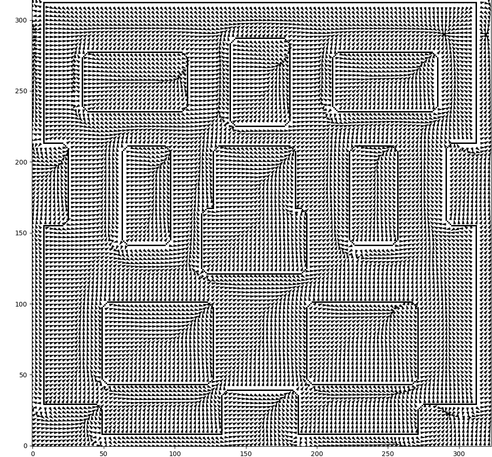

.. DE3 Robotics Coursework documentation master file, created by
   sphinx-quickstart on Wed Jan 27 19:02:39 2021.
   You can adapt this file completely to your liking, but it should at least
   contain the root `toctree` directive.

.. toctree::
   :maxdepth: 2
   :caption: Contents:

..
   .. figure:: img/diagram_side_view_2.png
      :width: 500
      :alt: map to buried treasure

      Figure 2: This is the caption of the figure (a simple paragraph).

==========================================================
Welcome to DE3 Robotics Group 1 Coursework 2 Documentation
==========================================================

We (Shafae Ali, Oscar Jones, Oscar Leclercq, Oliver Veal) have decided to create a readthedocs page for our coursework submissions instead of a Google Drive or Word document. This way this documentation can be used for teaching ROS at any point in the future, as well as have integrated code blocks and interactive videos.
For the purpose of archiving the document, we will be submitting in PDF and HTML formats.

.. warning::

    For a more interactive experience, please use the web_ version instead of the PDF. Thanks!

.. _web: https://robotics-coursework-de3.readthedocs.io/en/latest/#

=====
Setup
=====

Before starting, ensure that ``coursework_2.zip`` is extracted into the ``Desktop/DE3Robotics/src`` directory.

Then navigate the direction to ``cd Desktop/DE3Robotics`` and update the permissions of the workspace to be able to run DeNiro in gazebo using.

.. code:: python

   find -type f -iname "*.cfg" -exec chmod +x {} \;
   find -type f -iname "*.py" -exec chmod +x {} \;

Next build the workspace with ``catkin_make``. This may take a couple seconds, but will display completion.

Finally a DataFrame structure will be used to tackle Dijkstra’s
Open Terminator to input commands and run different services or files.

==================
C-Space Map
==================

------------------------
Task A: C-Space Dilation
------------------------

.. image:: img/c_space_dilation_lecture_illustration.png
   :width: 500
   :alt: c_space_dilation_lecture_illustration

*Figure 1: Illustrations of the lattice/grid search method to expand obstacles in c-space.* [1]_

The simplest way to avoid collisions when planning a route, is to inflate work-space obstacles to account for the size of the robot, as it is not just a point, when converting to configuration space. This is done by increasing the dimensions of obstacles on all sides and corners by half the dimensions of the robot. This way, if we plan the midpoint of the robot to follow the boundaries of a c-space obstacle on it’s route, it will not collide with the real obstacle. In task A, we do this by using a lattice/grid search to add numpy arrays of the given width of DE NIRO to the edges of the obstacles to create a new c-space map which DE NIRO can subsequently follow. This is done first by approximating the robot to be a square (Part i) then a circle (Part ii).

-------------------
Part i: Square Mask
-------------------
A square array of "1"s is simply made using the numpy function ``np.ones``. The scale of pixels on the c-space map compared to the work-space is given by the brief to be 16, so the size of the square array can be defined as *robot width* x *scale*, which is expressed in the line:

.. code:: python

   robot_px = int(robot_width * scale)

We then make robot_mask as a numpy array of ones of the right size using:

.. code:: python

   robot_mask = np.ones((robot_px, robot_px))

Scipy’s ``binary_dilation`` function expands the map using this array by tracing the obstacles boundaries with the centre of the array similarly to what is shown below with a circle.

.. image:: img/binary_dilation_illustration.png
   :width: 250
   :alt: binary_dilation_illustration

*Figure 2: Binary dilation illustration for a circle.* [2]_

.. code-block:: python
   :linenos:
   :caption: FINAL COMMENTED CODE FOR A PART I
   :emphasize-lines: 1

   #insert final code

Result:
-------

.. image:: img/ai_results.png
   :width: 500
   :alt: ai_results

*Figure 3: Original map (left), expanded c-space map for a square (right)*

----------------------
Part ii: Circular Mask
----------------------
To make the circle array of ones, we use the equation for a circle, *x*:sup:`2` + *y*:sup:`2` = *r*:sup:`2`. An array of ones the same size as the square array explained above is created and iterated through to check if each item is further from the centre point than the radius length (``DENIRO_width / 2``). If it is, it is changed to a zero. 

The centre of the array is in between four items as the width of the array is 16 px. If a list where an odd length, there would be a single middle value:

* Example: 1 2 3 **4** 5 6 7    <- middle value is 4

However, this 16x16 array is an even width and height, so the middle value must be an average:

* Example: 1 2 3 **4 5** 6 7 8  <- middle value is 4.5

For this array, the center is at (8.5, 8.5).

The array is visually displayed below:

*Figure 4: Circle array approximation of DENIRO.*

.. code-block:: python
   :linenos:
   :caption: FINAL COMMENTED CODE FOR A PART II

   #insert final code

Result:
-------

*Figure 5: Expanded map for a circle approximation of DE NIRO.*

====================
Waypoint Navigation
====================

----------------------------------
Task B: Adding Waypoints by Hand
----------------------------------

Manual waypoint planning enables quick visualizations of the shortest routes by visual inspection, looking at the expanded c-space map. It was quickly obvious that going from corner to corner of obstacles would be the shortest paths as this means going in direct, straight lines when in empty space between obstacles. 3 routes were tried with this method.
Points were chosen on the pixel map and converted to world coordinates using the function ``self.world_position()``, as shown in the code below.

.. code-block:: python
   :linenos:
   :emphasize-lines: 1,7
   :caption: FINAL COMMENTED CODE FOR CONVERTING COORDINATES

   p1 = self.world_position(np.array([191,104]))
   p2 = self.world_position(np.array([265,141]))
   p3 = self.world_position(np.array([292,237]))
       
   waypoints = np.array([
   [0,-6],
   p1[0],
   p2[0],
   p3[0],
   [8,8]
   ])

   #UPDATE WITH FINAL, COMMENTED CODE

The coordinates of DE NIRO’s starting position and destination were given as (0,-6) and (8,8) respectively (or (162,66) and (290,290) in pixel coordinates).

To compare the lengths of different routes, we used the following line of code which calculates the hypotenuse from one point to the other then sums:

.. code-block:: python
   :caption: FINAL COMMENTED CODE FOR CALCULATING PATH LENGTHS
   :emphasize-lines: 1

   distance = sum([sqrt((waypoints[i][0] - waypoints[i+1][0])**2 + (waypoints[i][1] - waypoints[i+1][1])**2) for i in range(len(waypoints)-1)])

   #UPDATE WITH FINAL, COMMENTED CODE

Results:
--------

Path 1
======

* P1 = (194, 121), or (2.03, -2.53) in world coordinates
* P2 = (210, 278), or (3.03, 7.28) in world coordinates

*Figure 6: Output of path 1*

Total length of path 1: **18.9m**

Path 2
======

* P1 = (194, 121), or (2.03, -2.53) in world coordinates
* P2 = (223, 211), or (3.84, 3.09) in world coordinates
* P3 = (286, 235), or (7.78, 4.59) in world coordinates

.. image:: img/b_path_2.png
   :width: 250
   :alt: b_path_2

*Figure 7: Output of path 2*

Total length of path 2: **17.6m**

Path 3
======

* P1 = (193,101), or (1.97, -3.78) in world coordinates
* P2 = (257,141), or (5.97, -1.28) in world coordinates
* P3 = (286,235), or (7.78, 4.59) in world coordinates

.. image:: img/b_path_3.png
   :width: 250
   :alt: b_path_3

*Figure 8: Output of path 3*

Total length of path 3: **17.2m**

Path 3 gave the shortest distance.

All code used to implement it is shown below, using the mentioned ``self.world_position()`` function and the distance calculation we wrote.

.. code-block:: python
   :linenos:
   :caption: FINAL COMMENTED CODE FOR TASK B COMBINED
   :emphasize-lines: 1
   
    def setup_waypoints(self):
        ############################################################### TASK B
        # Create an array of waypoints for the robot to navigate via to reach the goal
        
        p1 = self.world_position(np.array([191,104]))
        p2 = self.world_position(np.array([265,141]))
        p3 = self.world_position(np.array([292,237]))
       
        waypoints = np.array([
        
        [0,-6],
        p1[0],
        p2[0],
        p3[0],
        [8,8]
        ])  # fill this in with your waypoints
        
        print(self.world_position(np.array([191,104])))
                                  
        distance = sum([sqrt((waypoints[i][0] - waypoints[i+1][0])**2 + (waypoints[i][1] - waypoints[i+1][1])**2) for i in range(len(waypoints)-1)])
        
        print(distance)

        waypoints = np.vstack([initial_position, waypoints, self.goal])
        pixel_goal = self.map_position(self.goal)
        pixel_waypoints = self.map_position(waypoints)
        
        print('Waypoints:\n', waypoints)
        print('Waypoints in pixel coordinates:\n', pixel_waypoints)
        
        # PlottingS
        plt.imshow(self.pixel_map, vmin=0, vmax=1, origin='lower')
        plt.scatter(pixel_waypoints[:, 0], pixel_waypoints[:, 1])
        plt.plot(pixel_waypoints[:, 0], pixel_waypoints[:, 1])
        plt.show()
        
        self.waypoints = waypoints
        self.waypoint_index = 0

   #UPDATE WITH FINAL, COMMENTED CODE

In the video below, DE NIRO can be seen taking path 3

.. raw:: html

    

        <iframe src="https://drive.google.com/file/d/1cmUM8Awz4a6WJBK_ps9FwyYkRjAA53Ca/preview" width="640" height="480"></iframe>
    </div

=======
*Video 1: Robot DeNiro taking Path 3*

==========================
Potential Field Algorithm
==========================

---------------------------------------------------------------------------
Task C i: General Implementation of the Potential Field Algorithm
---------------------------------------------------------------------------

Analytical Derivation of Positive Force
---------------------------------------

To complete the code, we can compare the definitions of the forces to the equations given for those forces in the code.

.. code-block:: python
   :linenos:
   :emphasize-lines: 10,12,15

   # compute the positive force attracting the robot towards the goal
   # vector to goal position from DE NIRO
   goal_vector = goal - deniro_position
   # distance to goal position from DE NIRO
   distance_to_goal = np.linalg.norm(goal_vector)
   # unit vector in direction of goal from DE NIRO
   pos_force_direction = goal_vector / distance_to_goal
      
   # potential function
   pos_force_magnitude =     # your code here!
   # tuning parameter
   K_att =      # tune this parameter to achieve desired results
      
   # positive force
   positive_force = K_att * pos_force_direction * pos_force_magnitude  # normalised positive force

*Equation 1: Definition for force of attraction*

Line 15 in the above code corresponds to equation 1. We can compare the terms to the variables to deduce the definition of ``pos_force_magnitude`` which needs to be completed.

+--------+---------------------------+-----------------------------+
| Term   | Variable                  | Description                 |
+========+===========================+=============================+
| fatt   | ``positive_force``        | force in x and y components |
+--------+---------------------------+-----------------------------+
| K_att  | ``K_att``                 | constant coefficient        |
+--------+---------------------------+-----------------------------+
| Xg     | ``pos_force_direction``   | unit vector in x and y      |
+--------+---------------------------+-----------------------------+
| _      | ``pos_force_magnitude``   | scalar magnitude            |
+--------+---------------------------+-----------------------------+

Upon inspection, we can see that ``pos_force_magnitude`` must equal 1 for the given equation and that in the code to match.
This makes the positive force directly proportional to the direction to the goal, unaffected by distance.
``K_att`` in line 12 is the constant that will need tuning.

Analytical Derivation of Negative Force
---------------------------------------

A similar method to above can be used for the negative force.

.. code-block:: python
   :linenos:
   :emphasize-lines: 16,18,23

   # compute the negative force repelling the robot away from the obstacles
   obstacle_pixel_locations = np.argwhere(self.pixel_map == 1)
   # coordinates of every obstacle pixel
   obstacle_pixel_coordinates = np.array([obstacle_pixel_locations[:, 1], obstacle_pixel_locations[:, 0]]).T
   # coordinates of every obstacle pixel converted to world coordinates
   obstacle_positions = self.world_position(obstacle_pixel_coordinates)
      
   # vector to each obstacle from DE NIRO
   obstacle_vector = obstacle_positions - deniro_position   # vector from DE NIRO to obstacle
   # distance to obstacle from DE NIRO
   distance_to_obstacle = np.linalg.norm(obstacle_vector, axis=1).reshape((-1, 1))  # magnitude of vector
   # unit vector in direction of obstacle from DE NIRO
   force_direction = obstacle_vector / distance_to_obstacle   # normalised vector (for direction)
      
   # potential function
   force_magnitude =   # your code here!
   # tuning parameter
   K_rep =   # tune this parameter to achieve desired results
      
   # force from an individual obstacle pixel
   obstacle_force = force_direction * force_magnitude
   # total negative force on DE NIRO
   negative_force = K_rep * np.sum(obstacle_force, axis=0) / obstacle_pixel_locations.shape[0]

.. image:: img/f_rep_eq.png
   :width: 200
   :alt: Robot Diagram

*Equation 2: Equation for force of repulsion*

Line 23 defines the negative force.

+--------------+-----------------------------------------+--------------------------------------------------------------------------+
| Term         | Variable                                | Description                                                              |
+==============+=========================================+==========================================================================+
| frep         | ``negative_force``                      | force in x and y components                                              |
+--------------+-----------------------------------------+--------------------------------------------------------------------------+
| K_rep        | ``K_rep``                               | constant coefficient                                                     |
+--------------+-----------------------------------------+--------------------------------------------------------------------------+
| 1/N          | ``/ obstacle_pixel_locations.shape[0]`` | constant, 1 over number of obstacle pixels summed to normalise magnitude |
+--------------+-----------------------------------------+--------------------------------------------------------------------------+
| Sigma(xi/di) | ``np.sum(obstacle_force, axis=0)``      | scalar magnitude                                                         |
+--------------+-----------------------------------------+--------------------------------------------------------------------------+
| xi/di        | ``obstacle_force``                      | unit vector in x and y                                                   |
+--------------+-----------------------------------------+--------------------------------------------------------------------------+

We can see that xi/di in the equation is stored in ``obstacle_force`` in the code. ``obstacle_force`` is defined in the line above as ``force_direction * force_magnitude``.

If xi is defined as “the unit vector from the robot to obstacle”, then 1/di must be ``force_magnitude``. Given that di is defined as “the distance from the roboto to the obstacle”, this means in the ``force_magnitude`` definition, we should use ``1 / distance_to_obstacle``.

This makes the negative force inversely proportional to the distance from the robot to the sum of each obstacle pixel

.. important::
   This type of force falloff is a **linear** falloff.

Implementation
--------------

Running the code with the initial coefficients led deniro to crash into the table ahead.
To gain a better understanding of the influence of the potential field forces, we implemented different visualisation methods and chose the most useful to help iterate the paramters.
These methods began with making a clone of the “potential” function. Instead of using deniro’s position to calculate its own direction vector and returning an updated position, the function was nested inside for loops to iterate over every location in the room.
For each location, the vector direction was calculated.
This allows us to see at each location how deniro would react, and plot his expected path from the goal (sum of positive and negative forces).

Heat Map
--------

Our first idea was to plot heat maps of the forces experienced. This method was useful as a proof of concept, however there were some limitations when collapsing down the data to 3D (x, y, colour value).
This meant only one metric could be plotted.
Plotting magnitude of force shows relative strength but loses direction and positive / negative sign, but does give an idea of whether the edges are detected or whether deniro would run into obstacles.

.. image:: img/heat_map_mag.png
   :width: 500
   :alt: heat_map_mag

*Figure 9: Heat Map*

The magnitude could be split into x and y components and plotted separately, which also allows positive and negative values to be seen.
By superposing the graphs in your head, you can see in which x and y directions deniro would be pushed, gaining more understanding, however this is still not optimal.

.. image:: img/heat_map_x.png
   :width: 340
   :alt: heat_map_x

.. image:: img/heat_map_y.png
   :width: 340
   :alt: heat_map_y

*Figure 10, 11: Heat Map X component (left), Heat Map Y component (right)*

Vector Fields
-------------

A vector field plot was then considered.
This plot, known in pyplot as a “quiver”, plots vectors on a map at discrete intervals.
This shows the direction of the force and magnitude, and allows us to see much more clearly how deniro would be driven at each point in the map.

*Figure 12: Vector Field Map*

.. tip::
   Click on an image to bring up a full-resolution version of it!

Starting at the start, you can follow the vectors and see that deniro would be driven straight into the right obstacle.

These maps are much faster to generate than watching deniro run in the simulation, and provide much more insightful ideas on how the parameters affect the potential fields.

Parameter tuning
----------------
After running a few sets of parameters to gain some intuition, we saw that the repulsive force would need to be much greater than the attractive.
We also had an idea for the orders of magnitude to test.

.. code-block:: python
   :linenos:
   :emphasize-lines: 4,5

   def potential_field(self):
      ############################################################### TASK C ELITE VERISON
      
      for i in range(1,50,2):
         for j in range(50,1000,50):

Using the new function descibed above, we defined an initial parameter search area of ``1 < k_att < 50`` and ``50 < k_rep < 1000``.
These values were iterated over in steps of 2 and 50 respectively, with the plotted results from each saved out at a high resolution of 300 dpi with the used parameters in the file name.
We could then run through the plots and choose the one with the best behaviour, and identify the parameters.

.. raw:: html

    

        <iframe src="https://drive.google.com/file/d/1C0FReoqC88jh8Qm9eV_xRpVuDoknIFaz/preview" width="640" height="480"></iframe>
    
 it doesn't matter if the robot follows a path to the goal if it crashes on the way there.
- The positive force should be able to be "felt" on all parts of the map in roughly the same magnitude.

.. important::
   **As such, we propose the following modifications to the Potential Fields Algorithm:**

   #. Normalise the "mass" of each object by only considering the edges of the obstacle to provide a repulsive force (Implementation of this is detailed below).
   #. Take an average of the top 50 largest repulsive force contributions by magnitude (only include nearby forces).
   #. Make the positive and negative scalar parameters equal.

Method 1: Hollow Obstacles
--------------------------

We developed an approach to keep using the provided equations, but modify the C-space map to give DeNiro more of a chance to make it to the goal.
To consider only the edges of obstacles, we ran an edge detection algorithm over the expanded map. Or, equivalently, when creating the C-space map; create two maps, one dilating the obstacles using a mask 2px less wide than required, and another using the full width mask, then take the XOR of the two maps. XOR will only keep ``1`` values where they exist on the fully expanded map, but not on the less expanded map, i.e. the edges.
Paramters used below: ``K_att = 20   K_rep = 20``

*Figure 14, 15: Hollow obstacle map (left) and Hollow Obstacle map with vector field plot (right)*

.. note::
   The vector lines in this plot have been normalised as their magnitudes vary greatly. This would also be implemented in the robot control.

While this approach does help normalise the influence of obstacles by mostly ignoring their volume, it does not help against the “centre of mass” effect, and DeNiro is still pushed away from the centre of the room, with the same issues as in part i.

Method 2: Limited Search Area & Hollow Obstacles
---------------------------------------------------------------
Another approach which keeps the inverse falloff but may offer better results involves applying a “search window” around DeNiro.
This was implemented by sorting the influence of each pixel and summing only the greatest x number.
Using this method, DeNiro had much better success in making it to the goal.

The idea behind taking the average of the top n largest force contributions comes from `this article <https://medium.com/@rymshasiddiqui/path-planning-using-potential-field-algorithm-a30ad12bdb08>`_, in which the author describes how their method uses a ``max`` function on the negative forces from each obstacle, essentially considering only the repulsive force from the nearest object. We improve on this idea by not just taking the largest value, but an average of the n largest values, where n is a tunable parameter. The reason for doing this becomes apparent when looking at a very narrow section. When only taking the max, the effect is to produce a force near the the central line between obstacles that "oscillates" very rapidly between pointing in one direction or the other, primarly because it can only consider repulsion from one obstacle pixel at a time, and as the force falloff is linear, this will always be the closest pixel. In this simple case, averaging the force from the objects on both sides produces a much smoother path for the robot to follow; the the effects of being repelled by two close-by but opposing forces "cancels out". The effects of changing this average parameter are shown below:

**Effects of Tuning the Top-N Average Parameter**

... Diagrams and shit

**Valid Paths Produced By This Method**

*Figure 16, 17: Hollow obstacle map (left) and Hollow obstacle map with vector field plot (right)*

As the plot shows, the vector field lines all point away from the nearest obstacle, until the boundary at which they meet the next obstacle.
This boundary is almost equidistant between obstacles, and at which point is where the vectors sum to point towards the goal. This has the effect of pushing DeNiro onto the closest “path” which he then follows to the goal. This is a reliable model, and uses ``k_att`` and ``k_rep`` coefficients which are equal to each other; 20 was used in this test.
This approach introduces another parameter; the number of nearby obstacle pixels to sum.
A value of 40 was found to be optimal, with deviation either side not making much difference to the plotted paths.

**Edge Case Considerations**

Some consideration would need to be given to some edge cases with this algorithm, although they haven't neccessarily been explored here as this particular obstacle map is geometrically simple (rectangular, convex shapes for obstacles etc).

Consider for example consider the case of a single point obstacle close to a "wall" (line) of obstacle pixels. It is possible in this case to encounter the same problem as when just taking a global average of all pixel forces, that is, the repulsive force from the single pixel does not contribute enough to the average to avoid the robot from crashing into it.

To solve this issue, a more robust falloff function could be used that causes the repulsive force's magnitude to be extremely large when very close to an obstacle pixel, no matter the overall size of the obstacle:

Method 3: Square Inverse Falloff
----------------------------------------
An intuitive next step is to raise the power of the falloff of the repulsive force.
This helps the robot by ignoring points further away and only providing repulsion when it is very close to obstacles.
This avoids the issue of preventing the robot from moving through gaps, and allows the attractive force to be predominant in most spaces, only when very close to an obstacle does the repulsive force take effect.
We implemented a simple square fall off by squaring the distance_to_obstacle variable.
Using the same for loop iterative field plot testing approach, we found these coefficients to provide a clear path:
Paramters used below: ``K_att = 3  K_rep = 350``

.. image:: img/sqr_12_350.png
   :width: 340
   :alt: hollow_search

.. image:: img/sqr_12_350_path.jpg
   :width: 340
   :alt: hollow_search

*Figure 18, 19: Square inverse falloff vector map (left) and Square inverse falloff vector map with path (right)*

.. note::
   This method can be applied with hollow obstacles as well and provides similar results.

We then decided to test this route with DeNiro in Gazebo.
We recorded the DeNiro simulation and overlaid the vector field plot to validate if DeNiro follows the path as expected.
The results illustrate perfectly how DeNiro follows the expected path and reaches the goal.

.. raw:: html

    

        <iframe src="https://drive.google.com/file/d/1KAyHLxf4C0JemxyRrHUbYp8yyowIDgl6/preview" width="640" height="480"></iframe>
    </div

=========
*Video 3: Overlaid Vector Plot on Gazebo and Robot DeNiro Path*

Observations
------------

While Potential Field algorithms with well tuned parameters can provide a valid solution, it is worth discussing the optimality.
When compared with manually plotting waypoints, we can see that this route is not the shortest.
DeNiro should have turned right around the table and two chairs instead of left.
We can see from the potential fields however, that in this position the goal is more vertically than horizontally distant from DeNiro (i.e the direction vector is greater than 45 degrees).
This might be the reason that DeNiro chose the up-most path instead of turning right, as the direction vector pointed more up than right.
In such a case, it is difficult for the potential fields algorithm to know which route will be shorter.

However, comparing the solution from method **Method 2** to **Method 3**, we can see that the **Method 3** solution is more optimal for shortest distance.
The **Method 2** solution pushes DeNiro to the centroid path before continuing to the goal, even if that means going backwards initially.
The **Method 3** solution does not do this, but does instead push DeNiro towards the goal right up until obstacles, which he then follows around the edge.

See the figures below, where the **Method 2** solution takes DeNiro left, and then right along the path, whereas **Method 3** takes DeNiro straight up towards the opening to the goal.

*Figure 20: Method 2 (right), Method 3 (left)*

Method Comparison
-----------------

**Method 2**: Linear Falloff with Mass Normalisation (Hollow Obstacles) and Top-N Force Average:

Advantages:

- Potentially a "smoother" path with fewer rapid turns (if the avg is tuned correctly).
- Deals with narrow passages extremely smoothly.
- Better at dealing with non-convex obstacles as forces from futher away can have more impact, giving some situations a wider perception of the environment.
- Keeps the robots as far away from obstacles as possible while making good progress towards the goal.

Disadvantages:

- Usually a longer path, due to the path being more geometrically centered between obstacles (doesn't tend to "B-line" towards the goal, but remain between obstacles).

Use cases:

- If you need to keep the robot further away from obstacles.
- For example an RC boat where the water becomes shallow near obstacles (shores of islands for instance) so the ideal path should be more centrered.

**Method 3**: Inverse Square Falloff (With or Without Hollow Obstacles, Average of All Pixels)

Advantages:

- When far from any obstacles, almost no repulsive force is experienced.
- This means that when in free space, the robot will make a "B-line" towards the goal.
- When encountering an object, the obstacle essentially has a thin "force-field" around it, preventing collisions while maintaining close to the optimal path.

Disadvantages:

- Does not handle non-convex obstacles well; easy to get stuck inside them as the repulsive force is very local and doesn't take into account the wider surroundings.
- Essentially a "greedy" algorithm therefore (although not exactly in the traditional sense). Can product close to an optimal path but can be confounded easily as well.

Use cases:

- When you need a shorter path.
- When all or most of your important obstacles are convex shapes.
- When you don't care how close the robot comes to the obstacles.

==========================
Probabilistic Road Map
==========================

----------------------------------------
Task D i: Randomly Sampling from the Map
----------------------------------------

To generate a probabilistic roadmap, we first sample the whole map area randomly for points. This creates a set of random coordinates that then need to be verified as reachable by DE NIRO (i.e. if they are within the bounds of the expanded obstacles, they can not be reached and must be deleted).

*Figure 21: Example of randomly sampled points on a map before and after being marked as viable.* [1]_

The random points are generated by the code below:

.. code-block:: python
   :linenos:
   :caption: FINAL COMMENTED CODE FOR RANDOM GENERATION OF POINTS

   #insert final code

They are then iterated through and marked as a "1" in the rejection array by the code below:

.. code-block:: python
   :linenos:
   :caption: FINAL COMMENTED CODE FOR REJECTING POINTS

   i=0
   for point in pixel_points:
      if self.pixel_map[int(point[1]),int(point[0])] == 1:
         print("rejected")
         rejected[i] = 1
      i += 1
   
   #UPDATE WITH FINAL, COMMENTED CODE

With 100 points, here is how the distribution turned out, which can be visually confirmed to have marked rejected points correctly.

*Figure 22: Randomly distributed points for PRM marked as rejected or not*

----------------------------------
Task D ii: Harris Corner Detection
----------------------------------

**Method 1a: Pseudo Edge Detection**

One method would be to loop over every pixel in the map (or to save some computation time, some step size e.g. every 5 pixels) and take a sample of N points around the pixel in some shape (e.g. a loose grid with 2px spacing). Then take an average of the sampled values (e.g. 20 nearby pixels sampled, 8 of the are obstacle pixels, ``1``, and 12 of them are not, ``0``, giving an average value of 8/20 = 0.4), and multiply by some global probablity of placing a point at a given pixel (e.g. we want around ``N=100`` sampled points in total, and there are 320 * 320 = 102'400 pixels, so at each pixel the probabilty of placing a point there is 100 / 102'400). In total we will have fewer than our chosen number of sample points due to the obstacle probabilty multiplier, but we can account for this by increasing ``N``. Overall this method will have the effect of sampling more points near to the edges of obstacles, and especially if there is a small gap, given that we choose an appropriate sampling kernel.

What we have essentially done with this method is perform a convolution of the C-space map with a kernel of our choosing to create a "probabilty of sampling a point" map, then sampling that map to produce points for the PRM algorithm. The effect of this approach will be to reduce the number of points in open space, and increase the grouping of points around edges. This will help shorten the length of the path the algorithm produces, as well as deal better with narrow passages, as it can be shown that for an optimal path, each node in the graph will always lie on an edge (or for convex polygons, a corner) of an obstacle. This is explained in the following note:

.. note::
   **The optimal (shortest) path will always lie along the visiblity graph of the C-space map:**

**Method 1b: Edge Detection**

Alternatively, using an equavalent probabilistic sampling method by iterating over all the pixels in the map, but using the output of an edge detection filter implemented using SciPy or OpenCV would achieve slightly more optimal results, perhaps even more efficiently due the the optimisation of the functions in the mentioned libraries. You could also skip many iterations early by not bothering to probabilistically sample any points if they are a ``0`` in the output of the edge detection (i.e. not an edge).

**Method 2: Corner Detection**

As a result of the observation that for a map consisting of convex polygons (or at least, shapes with straight edges and sharp or filleted corners) such as the one in this coursework, the shortest path will always be along the visibility graph for the map. The points on the graph can be selected by using a corner detection filter on the C-space map, such as one implemented in ScyPi or OpenCV.

.. note::
   A caveat of only using corner detection to select points is that there are some cases of arrangements of obstacles where you will also need a point along the edge of an obstacle, not just on the corner, to create a proper visibility graph, or at last find a valid path. While this isn't the case for our relatively simple C-space map, it could be beneficial to combine both methods, that is, use corner detection to find the corners of shapes, then use edge detection to randomly sample points along the edges of the shapes as well. This way when it comes to creating the graph, it is more likely that a near-optimal and valid path can be created.

-----------------------------------------------------------------
Task E i: Creating the Graph, Tuning Distances for Creating Edges
-----------------------------------------------------------------

With the generated points completed in the previous task, the next step required is to create edges between neighbouring nodes. The task requires tuning of 2 parameters, ``mindist`` and ``maxdist``. These two variables define the minimum distance required before connecting neighbouring nodes, and the maximum allowable distance that nodes can connect to respectively. The reason these are critical to creating a graph is for the following:

Minimum Distance
   * Too High - Most neighbouring nodes will not be connected to leading to edges crossing over obstacles (which would be removed in the next part of the task) or a sparsity in the edges causing an incomplete path. 
   * Too Low - Nodes that may have been generated directly next to each other will be connected to each other, even though they offer no major advantage in getting further to the goal. It will likely make the path more jagged and less optimal. This is typically not a major issue, but should be tuned, such that unnecessary nearby connections are not made.

Maximum Distance
   * Too High - The main issue of this is an extremely and unnecessarily dense graph. In the code shown below, a distance matrix is created between every node and then this is evaluated by distances between the nodes to produce a list of acceptable nodes - relating to the process of tuning min/max distance. The edges between these acceptable nodes are then evaluated for collisions between obstacles and set as untraversable if True. If the graph is very dense, it means that an unnecessary amount of nodes are being evaluated for collisions, which results in excessive computational time for no reason. The end result of generating such a dense graph is that most edges will be rejected in the collision check they will likely cross-over obstacles. This is quite wasteful and highly unoptimised, therefore this parameter should be tuned as low as possible without making the graph incomplete. Furthermore, when the motion plan is being created, e.g. through Dijkstra's Algorithm, it creates excessive edges to evaluate, even after removing those colliding with objects.
   * Too Low - If this value is excessively low, then the graph will miss nodes to connect to that would be effective for travelling large distances and instead lead to discontinuity in the graph. This creates an issue for producing a complete motion plan, but can be easily resolved by increasing incrementally.

In summary, too few edges and the algorithm will fail to create a complete path that can be traversed from the starting point to the goal, too many edges and the number of edges to evaluate for collision increases resulting in unnecessary computation as most edges would be rejected anyway and visualizing the graph becomes far more difficult. Hence correctly tuning  min/max distances for creating edges is crucial for creating a graph suitable for evaluating to create a motion plan.

An iterative method was used to choose the values until a suitable graph was generated. 

Method:
   1. Start with any values, e.g. starting values in code, 0 for ``mindist`` and 20 for ``maxdist``.
   2. Check graph output visually and determine if edges create sufficient connection between starting node and goal node.
   
      a. If too many edges, either reduce ``maxdist`` or increase ``mindist``.

      b. If too few edges and graph is disconnected, increase ``maxdist`` or decrease ``mindist``
   3. If graph output is complete between starting node and goal node and density is inexcessive, finish iterations.

The following values were tested:

*Figure 23: Default Min 0 Max 20 - overly dense graph, completely unusable*

*Figure 24: Min 2 Max 3 - Graph has good density but sparse in some areas as minimum distance is likely too high*

.. image:: img/C2TE_MIN1MAX3.png
   :width: 250
   :alt: C2TE_MIN1MAX3

*Figure 25: Min 1 Max 3 - Improved graph but density could be increased by reducing* ``mindist`` *and increasing* ``maxdist``.

*Figure 26: Min 0.5 Max 3.5 - Improved graph, but density could be increased, therefore increase* ``maxdist``.

*Figure 27: Min 0.5 Max 3.8 - Ideal max value selected, good density of edges for long distances, but short distances between nodes could still be improved for more edge options when creating motion plan, decrease* ``mindist``.

*Figure 28: Min 0.2 Max 3.8 - Ideal graph with good overall edge density.*

----------------------------------------------------------
Task E ii: Creating the Graph, Tuning Edge Collision Check
----------------------------------------------------------

With a graph, all invalid edges must be removed before creating a motion plan. To do this, every edge is checked for collisions. Simple vector algebra is used to determine the distance and direction between two nodes. In the function, two arguments, ``pointA`` and ``pointB`` define the nodes to be evaluated. These are both in vector form, so to find the vector from ``pointA`` to ``pointB``, you simply take away ``pointB`` from ``pointA``. Then to evaluate distance, the ``linalg.norm`` method is used from the NumPy library where it calculates *vector norm*. This is defined as the Euclidean length of the vector or vector magnitude [3]_ , and is a neat, efficient way of calculating this information. Finally, the unit direction of the vector from A to B can be calculated by dividing the vector from A to B by the total distance. The following code implements this:

.. code-block:: python
   :linenos:
   :caption: FINAL COMMENTED CODE FOR CALCULATING UNIT DIRECTION OF VECTOR

   vector_B_to_A = pointB - pointA
   distance = np.linalg.norm(vector_B_to_A)
   direction = vector_B_to_A / distance

   #UPDATE WITH FINAL, COMMENTED CODE

The reason this is required is that distance and direction are evaluated in ``edge_points``. This variable creates an array of points to check collisions at from ``pointA`` in the direction to ``pointB``, until it reaches the end distance, and the number of points it checks in between is dictated by ``resolution`` - which is the next parameter to tune. The number of points along the direction is given by ``arrange(start, stop, step)`` with the starting value at 0 and the end as ``distance`` to ``pointB``, and values interpolated between these are defined by a step size named ``resolution``. This is why ``resolution`` is important to tune, as if it is too large, then there will not be enough points along the edge to measure for collision, meaning that it may skip past obstacles along the edge. Ideally this value is numerically low thus providing a *high* resolution. The ``reshape`` allows the variables to be multiplied and added in a suitable array form.

.. code-block:: python
   :linenos:
   :caption: FINAL COMMENTED CODE FOR EDGE_POINTS

   edge_points = pointA.reshape((1,2)) + np.arange(0, distance, resolution).reshape((-1, 1)) * direction.reshape((1,2))

   #UPDATE WITH FINAL, COMMENTED CODE

These points are then converted to pixel form such that they can be evaluated for collision with objects on the pixel map. If there is a collision with the object, the point is returned as ``True`` thus causing it to be unsuitable for use in the map.
Different resolutions were tested to see their effectiveness for removing edges. The default value in the code was used as a starting point to explore the effective and results shown below. Based on the logic of the code, it is expected that resolution should be defined as less than half the value of ``mindist`` so that it is able to check for obstacles along the shortest possible path - given than ``mindist`` is not zero. As a result it is expected that a value of 0.1m would be suitable, however given that the size of a pixel on the map is defined by 0.0.0625m, the lowest possible value to set it at is this. Therefore it is predicted 0.0625m will provide the best solution.

**Resolutions tested:**

.. image:: img/C2TE_RES5.png
   :width: 250
   :alt: C2TE_RES5

*Figure 29: 5 - Does not capture any information along the edge as the step is larger than the maximum distance, therefore all edges colliding with objects still present.*

*Figure 30: 3 - Detects very few obstacles but not all, likely due to the step size being close to* ``maxdist`` *value.*

*Figure 31: 2 - Captures more edges, but still not suitable step size (resolution) for shorter distances.*

*Figure 32: 1 - Majority of edges detected in this, but would not be suitable for shorter distances which may occur in a different iteration (given that points are generated randomly).*

.. image:: img/C2TE_RES0_5.png
   :width: 250
   :alt: C2TE_RES0_5

*Figure 33: 0.5 - Improved result from previous iteration, but would be more robust to decrease to hypothesised value of 0.16m.*

*Figure 34: 0.0625 - Highest possible resolution to check along a line by checking across each pixel.*

*Figure 35: 0.0625, zoomed in - taking a closer look at one of the edges, it is clear that the resolution is highly effective and has now produced a suitable graph with no collision with obstacles.*

Another parameter that could be used to remove edges or potentially create edges in the first place, such as in the first task, would be to optimise the path for Robot DeNiro. The robot is non-holonomic and must rotate its wheels in opposite directions to spin on the spot. Therefore, one potential option that could be used to improve the motion plan would be to reject any edges with large changes in direction. This could be implemented by comparing unit direction vectors and defining a maximum allowable change in direction. Although this may not be the shortest distance, it could potentially be more efficient for Robot DeNiro to traverse. Once the suitable graph would be created based on this, the same process of Dijkstra’s algorithm to find the shortest path would be implemented. This process could be likened to implementing *motion primitives* that limit the allowable angles that can be used.

--------------------------------------------------------------
Task E iii: Creating the Graph, Completing an Incomplete Graph
--------------------------------------------------------------

From PRM to Visibility Graph
----------------------------

A randomly generated graph is likely not the optimal route to the goal, and may not even find a route under certain conditions.
For example, the narrow passage between the central obstacle and the upper is often undiscovered, as well as other areas of the map.
Increasing the number of points can help, but there are more optimal approaches.

From the experimenting in manually placing waypoints, seeing the routes proposed by the potential fields, and from intuition, the shortest route to the goal is often found by traversing the corners of the obstacles.
Some intuitive rules can be applied to justify this:

- The fastest way across an open area is in a straight line, it will never be faster to zigzag
- Therefore, points in open space can be considered redundant
- The fastest way to get around an obstacle is to go to it’s corner, turn and carry on. This can be visualised by pulling a piece of string taught with an obstacle in the way.
- Therefore, you are left with only corners.

With this logic, a more optimal PRM algorithm would make sure to place more points around obstacle vertices, ensuring all the essential points were covered to find a route to the goal.
By extension of this logic, what if only the corners were plotted? To test this, a corner detection algorithm was written to identify and place points only at vertices.
The resulting graph takes a fraction of the time to compute given the far fewer points, and is guaranteed to give the best chance of finding the best route. This turns the PRM method into an optimal method, and shows the path we initially used in the manual waypoints section.

Dijkstra’s algorithm can then be used to find the shortest path (discussed later).

*Figure 36: Corner Detection*

-------------------------------------------------
Task F i: Dijkstra's Algorithm, Creating the Path
-------------------------------------------------

With a completed graph with all edges validated where they do not collide with obstacles, it is now possible to evaluate the graph and find the shortest distance from the start node to the goal node that can be traversed by the robot. One of the methods used to find the shortest distance of a weighted graph is Dijkstra’s Algorithm. To begin, the task requires that each initial cost of all unvisited nodes is set to a large value under ``initial_cost`` - e.g. 1,000,000. This means that it will be guaranteed that the value is updated with an actual cost if the node is visited as it will definitely be lower than 1,000,000, and that solutions for nodes that weren’t visited are not implemented to produce incorrect results.

Before starting the second part of the task, an overview of Dijkstra’s to understand the theory behind the method is beneficial for understanding how the shortest distance motion plan is generated. Once provided with a graph, the algorithm requires a starting node. The starting node will be used to begin the algorithm and mark all the shortest distances to get to each node. Then a goal node is specified and the algorithm will output a single shortest distance graph which defines the motion plan.

General algorithm for Dijkstra’s [4]_:

*Figure 37, 38: Node Key (left) and Initial Graph (right)*

1. Mark the initial node costs from the starting node, e.g. A has a distance of 0. The rest are unvisited so set them with an extremely high value, e.g. 1,000,000 or 1e6. This has been marked in the example. Also establish a list of all visited and unvisited nodes. 

   .. image:: img/Fi_D1.png
      :width: 300
      :alt: Fi_D1

*Figure 39: Dijkstra Step 1*

2. Visit the node which has the lowest cost from the start and update the visited nodes dataframe. Mark the previous node from which the cost was calculated from to get to the visited node. In the example, A has the lowest cost, so it is added as a visited node. 

   .. image:: img/Fi_D2.png
      :width: 300
      :alt: Fi_D2

*Figure 40: Dijkstra Step 2*

3. Examine the unvisited neighbours of the current node and mark the cost to go to them from the starting node, including the node's traversed to get to them. If the new cost is less than the previous cost, update it with the new cost, if it is greater than the previous cost, then leave the value unchanged. In the example, it is the edge cost from A to B, C and D respectively with all values updated. 

   .. image:: img/Fi_D3.png
      :width: 300
      :alt: Fi_D3

*Figure 41: Dijkstra Step 3*

4. Repeat steps 2 - 3 until all unvisited nodes have been visited. In the example, B has the lowest cost so is marked as visited. Its unvisited neighbours are C and E, with the value of C lower than before, therefore updated from 4 to 3. 

   .. image:: img/Fi_D4.png
      :width: 300
      :alt: Fi_D4

*Figure 42: Dijkstra Step 4, algorithm complete and repeats, further steps specfic to problem shown*

5. The smallest cost is now C, so it is marked as a visited node. The neighbouring nodes are evaluated, F, and it is found that the cost from the starting node is 8, i.e. 3 + 5 = 8. 

   .. image:: img/Fi_D5.png
      :width: 300
      :alt: Fi_D5

*Figure 43: Dijkstra Step 5*

6. The smallest cost is E, so i marked as a visite dnode. Its neighbouring node F, has an updated cost from 8 to 7. 

   .. image:: img/Fi_D6.png
      :width: 300
      :alt: Fi_D6

*Figure 44: Dijkstra Step 6*

7. D has the smallest cost so is visited next and the visited nodes list is updated. The neighbouring nodes are evaluated and it is found that no cost is lowered. 

   .. image:: img/Fi_D7.png
      :width: 300
      :alt: Fi_D7

*Figure 45: Dijkstra Step 7*

8. The final node left to visit is F. This means all nodes have now been visited and the **ALGORITHM IS COMPLETE**. The number of steps required will depend on the number of nodes to evaluate. 

   .. image:: img/Fi_D8.png
      :width: 300
      :alt: Fi_D8

*Figure 46: Dijkstra Step 8*

This is the general theory and can vary slightly depending on implementation. The Python implementation for this in ``motion_planning.py`` is explained in the code block below.

.. code-block:: python
   :linenos:
   :caption: CODE?

   #UPDATE WITH FINAL, COMMENTED CODE

The second part of the task is straightforward as it asks to find the cost of going from the initial node to the next node via the current node. This is the equivalent of in the general explanation which is to keep track and update the cost from the starting node to the neighbouring nodes through the current node, only if the cost is lower. Initial to current node is defined by ``current_cost`` and neighbouring node cost between current node is defined by ``edge cost``, therefore the total cost is stated as:

.. code-block:: python

   next_cost_trial = current_cost + edge_cost

This is iterated from every neighbouring point until the graph is complete and a motion plan is generated.

The plan generated appears to be very similar to the Path 3 route generated in Task B. The method used to produce this was to connect the vertices of each obstacle together (essentially a partial visibility graph), in an attempt to find the shortest distance. It is clear that the manual method where we rationalised our shortest route and calculated it, has a very similar output to the randomly distributed points of PRM with Dijkstra’s shortest path, meaning the tuning of our ``mindist``, ``maxdist`` and ``resolution`` is fairly good. There are some key differences however. There are far greater waypoints in between, meaning that RobotDeNiro will have to perform turns more often which is not ideal given he is non-holonomic and steering is slow. When viewing the completion of this path, the more turns and longer distance was confirmed as the simulation took longer.
Although Dijkstra’s did provide the optimal shortest path, it only did this with the graph that was provided, which was generated from the random points. Therefore the path is clearly not as optimised as it could be. The total distance was 19.2m compared to 17.2m.

*Figure 47: Dijkstra shortest path based on randomly distributed points*      

The path is clearly not as optimal as it relies on the random distribution of points generated by the PRM algorithm implemented. Dijkstra provides locally optimal choices at each stage to find the global optimum. Although close in this case, it could’ve been complete if the points generated were different and hence the path. To generate a more optimal route using Dijkstra’s, we instead used corner detection to produce the points.

.. raw:: html

    

        <iframe src="https://drive.google.com/file/d/1xkdDy6k7mvBvuL7CXOmvn1GdD-2BU8Xg/preview" width="640" height="480"></iframe>
    

        <iframe src="https://drive.google.com/file/d/1aTEHT9rzB-BCMKe2YtuuixUtTVI1F9d5/preview" width="640" height="480"></iframe>
    </div

======
*Video 5: Corner Detection Dijkstra Algorithm Path*

----------------------------------------------------
Task F ii: Dijkstra's Algorithm, Planning Algorithms
----------------------------------------------------

Dijkstra’s algorithm is defined as a one-to-many planning algorithm or a SSSP (Single Source Shortest Path) where it is able to find the shortest distance from the starting node to every other node in the graph. This is clearly seen in the example run through of a general use of Dijkstra’s.

The advantages of a one-to-many planning algorithm is that:
If all desired nodes are added from the start, then the algorithm only needs to be run once to find the shortest distance to them from a starting point. However if a new node is added, the values would have to be recalculated for the whole graph, or if the starting node was changed.

The main advantage of Dijkstra’s algorithm is the relatively low complexity that makes it close to linear. It has a complexity of O(V + E . log(V)), where V is the number of nodes and E is the number of edges. [5]_ Given that E equals close to V^2, the complexity is O (V +V^2 . log(V)). There are however motion planning algorithms with even lower complexity than this.

It is fairly straightforward to implement and a common algorithm for motion planning.

The issue comes in when changing the start point, so if from the goal node, you want to calculate a new goal node, the entire graph would need to be recalculated. This means that with changing starting points, the entire graph needs to be recalculated. In most motion planning problems, it is unlikely that Dijkstra will be beneficial as the starting node rarely stays the same. Dijkstra’s algorithm is not optimal and actually quite inefficient if the starting node is changing frequently. To find the shortest distance from two specific points only (starting node and goal node), A* is a better algorithm to utilise. [6]_

A* is a one-to-one planning algorithm that is more efficient than Dijkstra’s when focusing on the path between two specific nodes. It utilises an admissible heuristic that provides an estimate of the distance between nodes in the graph and the goal node. A particular example of this is to use Manhattan distances which uses grid coordinates for each node. There are however multiple heuristics that can be adopted. The benefit of this is that it favours nodes which get closer to the goal node, meaning that all nodes do not need to be evaluated. [7]_

Each time moving from one node to another, an estimate of the distance remaining from the destination will help in informing the next move. If the graph was a map of the world, then the straight line distance can be calculated from the longitude and latitude of each point. A* is an enhancement of Dijkstra’s algorithm, except it has added heuristics to inform the next move. For example if the Euclidean distance is provided between each node and the goal node, and this is stated as Heuristic distance H. Then a second value of cost from the starting node is given, where cost is G (the same as in Dijkstra’s). Then a simple heuristic would be f = G + H. Instead of choosing the node with the lowest cost, like in Dijkstra’s, instead the node with the lowest f value would be selected. This is iterated further similar to Dijkstra’s but the end result is that every vertex need not be visited. As the graph scales up, the saving in time and computation is more pronounced, which is why A* is the desired motion plan when using one-to-one planning (starting node and goal node). Again, the heuristic is arbitrary and can be adapted for the situation accordingly.

A summary of A* pathfinding algorithm is provided here:
   * A* finds the shortest path between two vertices
   * A* does not typically have to visit all vertices
   * A* selects the node with the lowest f value where f = G + H. The cost, G, is the same as Dijkstra’s Algorithm, whereas H is a heuristic relevant to A* that can be defined in many ways, e.g. Euclidean Distance. The node with the lowest f value is selected until the goal node is reached.
   * The better the heuristic, the quicker the path can be found without visiting all nodes
   * The heuristic is typically problem specific
   * A* will always find a solution if one exists

-----------------
Supporting Videos
-----------------

Short Video of Achievements
---------------------------

.. raw:: html

    

        <iframe src="https://drive.google.com/file/d/1K6aFzmTIcEtJk1uIpwosfEYtMwy4TYOz/preview" width="640" height="480"></iframe>
    

        <iframe src="https://drive.google.com/file/d/1FKHNNQ953DjILROMgBm2bznpT5S7EpHU/preview" width="640" height="480"></iframe>
    

        <iframe src="https://drive.google.com/file/d/1S8u39y-hh95IlLO-t3of_ZcpE3gOOLmG/preview" width="640" height="480"></iframe>
    </div

==========
References
==========

.. [1] | Kormushev, P. & Nanayakkara, T. (2020) \ *DESE96005 - Robotics 2020-2021 - Course Notes*
       | *and Lectures* [Module Content] Imperial College London.
.. [2] | *Dilation (morphology).* [Online] Wikipedia. Wikimedia Foundation; Available from: 
       | https://en.wikipedia.org/wiki/Dilation_%28morphology%29 [Accessed: 24th February 2021] 
.. [3] | Brownlee J. *Gentle Introduction to Vector Norms in Machine Learning.* [Online] Machine Learning 
       | Mastery. Available from: https://machinelearningmastery.com/vector-norms-machine-learning/ 
       | [Accessed: 24th February 2021]
.. [4] | *Coding Games and Programming Challenges to Code Better.* [Online] CodinGame. Available from: 
       | https://www.codingame.com/playgrounds/1608/shortest-paths-with-dijkstras-algorithm/dijkstras-algorithm
       | [Accessed: 24th February 2021] 
.. [5] | Sryheni S. *Dijkstra's vs Bellman-Ford Algorithm.* [Online] Baeldung on Computer Science. 
       | Available from: https://www.baeldung.com/cs/dijkstra-vs-bellman-ford#:~:text=The%20main%20advantage%20of%20Dijkstra’s,algorithm%20can’t%20be%20used.&amp;text=%2C%20if%20we%20need%20to%20calculate,is%20not%20a%20good%20option. 
       | [Accessed: 24th February 2021]
.. [6] | Isaac Computer Science. Available from: https://isaaccomputerscience.org/concepts/dsa_search_dijkstra 
       | [Accessed: 24th February 2021]
.. [7] | *Graph Data Structure 6. The A* Pathfinding Algorithm* [Online Video] Computer Science. Youtube.
       | Available from: https://www.youtube.com/watch?v=eSOJ3ARN5FM&ab_channel=ComputerScience 
       | [Accessed: 24th February 2021]