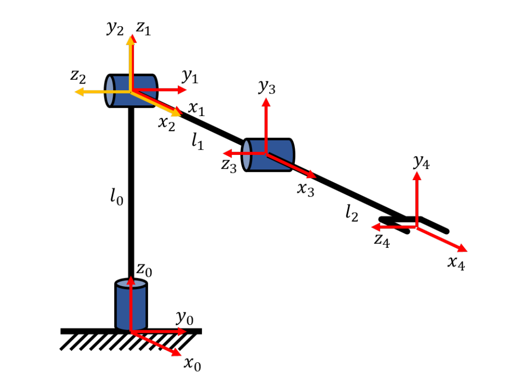
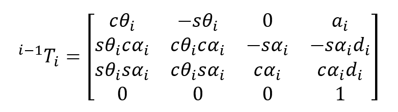
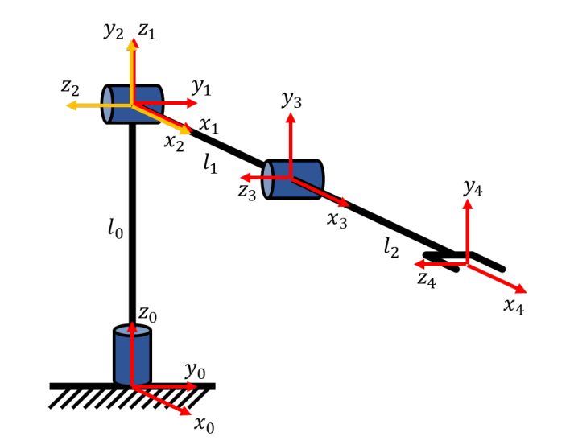

.. DE3 Robotics Coursework documentation master file, created by
   sphinx-quickstart on Wed Jan 27 19:02:39 2021.
   You can adapt this file completely to your liking, but it should at least
   contain the root `toctree` directive.

.. toctree::
   :maxdepth: 2
   :caption: Contents:

========================================================
Welcome to DE3 Robotics Group 1 Coursework Documentation
========================================================

We are the **BROBOTICISTS** and this is our journey.

We have decided to create a Readthedocs page for our coursework submissions instead of a Google Drive document. This way this documentation can be used for teaching ROS at any point in the future, as well as integrated code blocks and interactive videos.

.. warning::

    For an epic ROS gamer UI experience, please use the web_ version instead of the PDF. Thanks!

.. _web: https://robotics-coursework-de3.readthedocs.io/en/latest/#

============
Introduction
============

**Login for VM machine**

Password: deniro123

Open Terminator to input commands to run different services or files

.. note::
   Top Tip! The shortcut for opening new terminal instances:

   - ‘Ctrl+Shift+o’ - split horizontally
   - ‘Ctrl+Shift+e’ - split vertically

================================================
Starting the Virtual Machine and Troubleshooting
================================================

Troubleshooting notes here

==================
Forward Kinematics
==================

-------------------------------
Task A: Computing the D-H Table
-------------------------------

This task initialises the Denavit-Hartenberg, D-H, table. The table contains all the necessary information to orientate each link of the robot in a consistent manner so that the position of each link can be found relative to the other. As the robot moves, the D-H table is updated. The D-H table is a convenient way to store this information as the transformation matrix for each link can be evaluated using the corresponding row in the table.

The numpy array, self.DH_tab, in line 230 of kinematics.py is the live D-H table for the robot. It’s initial state is entered, with link lengths stored in self.links[n], where n is link number. This refers to a list self.links created in line 225. The list is based on the link_lengths variable which is passed into the function. This function is the __init__ of the ``RobotKineClass()`` class, meaning it is called when the robot object is created when the code is run. The list of link lengths is passed in as the only parameter when the ``RobotKineClass()`` is called.

.. code-block:: python
   :linenos:
   :emphasize-lines: 13-16

    class RobotKineClass():

    def __init__(self,link_lengths):

        self.ROSPublishers = set_joint_publisher()

        self.nj = 3    #number of joints
        self.links = link_lengths    # length of links

        ################################################ TASK 1
        #Define DH table for each link. DH_tab in R^njx4
        #d,theta,a,alpha
        self.DH_tab = np.array([[self.links[0], 0., 0., 0.],
                                [0., 0., 0., pi/2.],
                                [0., 0., self.links[1], 0.],
                                [0., 0., self.links[2], 0.]])
        self.joint_types = 'rrr'	# three revolute joints

Derivation
----------------------------

a

Insert images showing derivation

*Diagram of robot with reference axes [1]*

*Table 1: D-H Table based on derivation*

+-------+--------+--------+--------+--------+
| link  | d      | theta  | a      | alpha  |
+=======+========+========+========+========+
| 1     | l0     | theta1 | 0      | 0      |
+-------+--------+--------+--------+--------+
| 2     | 0      | theta2 | 0      | pi/2   |
+-------+--------+--------+--------+--------+
| 3     | 0      | theta3 | l1     | 0      |
+-------+--------+--------+--------+--------+
| 4     | 0      | 0      | l2     | 0      |
+-------+--------+--------+--------+--------+

The function getFK(self,q) accesses the DH_tab a row at a time and copies the ith row to DH_params to compute the transformation matrix from one frame to the next.
A list q of current joint angles (theta) is passed in, and added to the base-state DH_params, in order to compute the current transformation matrix.
This is how the DH table is “updated” with changing theta.

.. code-block:: python
   :linenos:

   def getFK(self,q):

   T_0_i_1 = np.identity(4)
   for i in range(self.nj):

      DH_params = np.copy(self.DH_tab[i,:])
      #print('q',q)
      #print(DH_params)
      if self.joint_types[i] == 'r':
            DH_params[1] = DH_params[1]+q[i]
      elif self.joint_types[i] == 'p':
            DH_params[0] = DH_params[0]+q[i]

Therefore, since theta in the D-H table is updated by iteration at each step rather than updating a variable, theta1, theta2, and theta3 are set to 0.
This is because the base configuration of the robot is such that the ith joints are in line with each other which results in the angles being set to 0.
These results are entered into the D-H table defined in the code.

.. code-block:: python
   :linenos:

   self.DH_tab = np.array([[self.links[0], 0., 0., 0.],
                        [0., 0., 0., pi/2.],
                        [0., 0., self.links[1], 0.],
                        [0., 0., self.links[2], 0.]])

----------------------------
Task B: Coding the D-H Table
----------------------------

The numpy array, DH_matrix, in line 211 represents the transformation matrix from frame i-1 to frame i.
As such, the transformation matrices of each joint can be multiplied in a chain to transform coordinates from the end effector frame to the base frame.
This is taken care of in the next section, this function DH_matrix() only creates the i-1 to i matrix.
The definition for this is shown below, and simply written in Python

.. code-block:: python
   :linenos:
   :emphasize-lines: 9-12
   
   def DH_matrix(DH_params):
      d = DH_params[0]
      theta = DH_params[1]
      a = DH_params[2]
      alpha = DH_params[3]
      
      ################################################ TASK 2
      DH_matrix = np.array(
      [[cos(theta) , -sin(theta), 0, a],                     
      [sin(theta)*cos(alpha), cos(theta)*cos(alpha), -sin(alpha), -sin(alpha)*d],
      [sin(theta)*sin(alpha) ,cos(theta)*sin(alpha), cos(alpha), cos(alpha)*d],
      [0., 0., 0., 1.]])

------------------------------------
Task C: Computing Forward Kinematics
------------------------------------

This function gets the forward kinematics, FK, of the robot as any given instance.
It involves multiplying each on the link transformation matrices together to make the compound transformation matrix.
This is done iteratively in a for loop, beginning line 4. The matrix is updated in line 17.

.. code-block:: python
   :linenos:
   :emphasize-lines: 4, 17

   def getFK(self,q):

         T_0_i_1 = np.identity(4)
         for i in range(self.nj):

               DH_params = np.copy(self.DH_tab[i,:])
               #print('q',q)
               #print(DH_params)
               if self.joint_types[i] == 'r':
                  DH_params[1] = DH_params[1]+q[i]
               elif self.joint_types[i] == 'p':
                  DH_params[0] = DH_params[0]+q[i]
               
               T_i_1_i = DH_matrix(DH_params) #Pose of joint i wrt i-1
               
               ################################################ TASK 3 (replace np.eye(4) with the correct matrices)
               # np.matmul operation here # #Pose of joint i wrt base

               T_0_i_1 = T_0_i
         T_0_n_1 = T_0_i
         DH_params = np.copy(self.DH_tab[self.nj, :])
         T_n_1_n = DH_matrix(DH_params)
         T_0_n = np.matmul(T_0_n_1, T_n_1_n)

The following equation shows how the pose of the end effector can be calculated with respect to the base frame; by multiplying together the transformation matrices of each joint.

.. image:: img/task_c_eq1.png
   :width: 414
   :alt: Task C equation 1

To do this iteratively, premultiply the transformation matrix of the ith frame by the matrix of the i-1th frame, for each frame.

.. image:: img/task_c_eq2.png
   :width: 286
   :alt: Task C equation 2

The following line of code implements this equation inside the loop that iterates over each joint.
Np.matmul is a numpy function that multiplies two matrices together. T_0_i is  the matrix giving the ith joint wrt the base frame and is updated at each iteration.
T_0_i_1 is the matrix from the base frame to the i-1th frame, and T_i_1_i is the matrix from the i-1th frame to the ith frame.
The code iteratively calls the previous function DH_matrix() to get the i-1 to i transformation matrix, T_i_1_i.

.. code-block:: python
   :linenos:
   :emphasize-lines: 17

   def getFK(self,q):

        T_0_i_1 = np.identity(4)
        for i in range(self.nj):

            DH_params = np.copy(self.DH_tab[i,:])
            #print('q',q)
            #print(DH_params)
            if self.joint_types[i] == 'r':
                DH_params[1] = DH_params[1]+q[i]
            elif self.joint_types[i] == 'p':
                DH_params[0] = DH_params[0]+q[i]
            
            T_i_1_i = DH_matrix(DH_params) #Pose of joint i wrt i-1
            
            ################################################ TASK 3 (replace np.eye(4) with the correct matrices)
            T_0_i = np.matmul(T_0_i_1, T_i_1_i) #Pose of joint i wrt base

            T_0_i_1 = T_0_i
        T_0_n_1 = T_0_i
        DH_params = np.copy(self.DH_tab[self.nj, :])
        T_n_1_n = DH_matrix(DH_params)
        T_0_n = np.matmul(T_0_n_1, T_n_1_n)

To test the code, open a new terminal and run

.. code-block:: python
   :linenos:

   cd Desktop/DE3Robotics/src/coursework_1/src
   python3 kinematics.py fk 

The FK model runs successfully if the following message appears:

.. code-block:: python
   :linenos:
   
   "Forward Kinematics calculations are correct, well done!"

==================
Inverse Kinematics
==================

-----------------------------------------------
Task D: Checking if a point is in the workspace
-----------------------------------------------

text

--------------------------------------
Task E: Calculating Inverse Kinematics
--------------------------------------

text

---------------------------------
Task F: Coding Inverse Kinematics
---------------------------------

text

=======================
Differential Kinematics
=======================

-------------------------------
Task G: Computing the Jacobian
-------------------------------

=============
Robot Control
=============

-----------------------------------------------
Task H: Tuning Controller Gains
-----------------------------------------------

text

------------------------------
Task I: Adapting the Robot Arm
------------------------------

text

---------------------------------
Task J: Adapting Controller Gains
---------------------------------

text

test image

