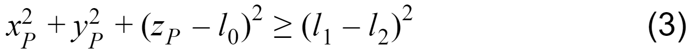

.. DE3 Robotics Coursework documentation master file, created by
   sphinx-quickstart on Wed Jan 27 19:02:39 2021.
   You can adapt this file completely to your liking, but it should at least
   contain the root `toctree` directive.

.. toctree::
   :maxdepth: 2
   :caption: Contents:

========================================================
Welcome to DE3 Robotics Group 1 Coursework Documentation
========================================================

We are the **BROBOTICISTS**.
We have decided to create a readthedocs page for our coursework submissions instead of a Google Drive or Word document. This way this documentation can be used for teaching ROS at any point in the future, as well as have integrated code blocks and interactive videos.
For the purpose of archiving the document, we will be submitting in a PDF format.

.. warning::

    For a more interactive experience, please use the web_ version instead of the PDF. Thanks!

.. _web: https://robotics-coursework-de3.readthedocs.io/en/latest/#

=====
Setup
=====

Open Terminator to input commands and run different services or files.

Start by entering ``roscore`` - this is required to launch nodes and programs for the roscore system to start. It must be running in order for ROS nodes to communicate.

To start gazebo, in a new terminal, use ``rosrun gazebo_ros gazebo``, which generates an empty world.

- To close this instance use ``Ctrl+c``. 
- To close the Gazebo properly, in case multiple instances are running and it does not close, run ``killall gzserver gzclient``. The following response should occur if it has closed, ``gzserver: no process found`` and ``gzclient: no process found``.

Now it is possible to add the robotic arm to the simulation. In a new terminal run:

- ``cd Desktop/DE3Robotics``
- ``source devel/setup.bash``
- ``roslaunch coursework_1 coursework_1.launch``

The robotic arm should now be in Gazebo

.. note::
   Open Terminator to input commands to run different services or files
   
   Top Tip! The shortcut for opening new terminal instances:

   - ‘Ctrl+Shift+o’ - split horizontally
   - ‘Ctrl+Shift+e’ - split vertically

==================
Forward Kinematics
==================

-------------------------------
Task A: Computing the D-H Table
-------------------------------

This task initialises the Denavit-Hartenberg, D-H, table.
The table contains all the necessary information to orientate each link of the robot in a consistent manner so that the position of each link can be found relative to the other.
As the robot moves, the D-H table is updated.
The D-H table is a convenient way to store this information as the transformation matrix for each link can be evaluated using the corresponding row in the table.

Derivation
----------------------------

To make the D-H table, the reference frames for each joint and for the end-effector must first be made and assigned origins and orientations. This is done according to the Denavit-Hartenberg convention. The steps for doing so with this particular robot are detailed below:

   1. Origin of *frame 0* was set at *joint 1*
   2. |z0| was set arbitrarily for simplicity pointing upwards towards *joint 2*
   3. Origin of *frame 1* was set at the intersection of the joint axes of *joint 1* and *joint 2*, so in the middle of the *joint 2*
   4. |z1| was set in the direction of the joint axis of *joint 1* and with the positive direction defined by the positive direction of rotation of *joint 1* (using the right-hand rule), so directly upwards
   5. Origin of *frame 2* was set at the same place as the origin of *frame 1*
   6. |z2| was set in the direction of the joint axis of *joint 2* and with the positive direction defined by the positive direction of rotation of *joint 2*
   7. Since |z1| and |z2| intersect, |x1| was set as the normal to the plane containing |z1| and |z2|, pointing towards *joint 3*
   8. For simplicity, |x0| was arbitrarily set as parallel and pointing in the same direction as |x1| in the starting position
   9. Origin of *frame 3* was set at the intersection of the joint axis of *joint 3* and the common perpendicular of the joint axes of *joint 2* and *joint 3* along |l1|, so in the centre of *joint 3*
   10. |z3| was set in the direction of the joint axis of *joint 3* and with the positive direction defined by the positive direction of rotation of *joint 3*
   11. |x2| was set as pointing along the common perpendicular of |z2| and |z3| along |l1|, pointing at *joint 3* 
   12. Origin of *frame 4* was set at the centre of the end effector
   13. For simplicity, |z4| was arbitrarily set to be parallel to and in the same direction as |z3|
   14. |x3| was set as pointing along the common perpendicular of |z3| and |z4| towards the origin of *frame 4*
   15. For simplicity, |x4| was arbitrarily set as parallel to and in the same direction as |x3|
   16. All *y* axes were set according to the right-hand coordinate system convention, completing the setup.

The result of this setup is shown below:

*Diagram of robot with D-H conventional reference axes*

Using this diagram, the Denavit-Hartenberg table was made according to the following definitions:

   1. |ai| = the distance from |zi-1| to |zi| measured along |xi-1|
   2. |αi| = the angle between |zi-1| and |zi| measured about |xi-1|
   3. |di| = the distance from |xi-1| to |xi| measured along |zi|
   4. |θi| = the angle between |xi-1| and |xi| measured about |zi|

The resulting table is shown below:

*Table 1: D-H Table based on derivation*

+-----+-----+-----+-----+-----+
|Link |  d  |  θ  |  a  |  α  |
+=====+=====+=====+=====+=====+
|**1**||l0| ||θ1| |  0  |  0  |
+-----+-----+-----+-----+-----+
|**2**|  0  ||θ2| |  0  |*π*/2|
+-----+-----+-----+-----+-----+
|**3**|  0  ||θ3| ||l1| |  0  |
+-----+-----+-----+-----+-----+
|**4**|  0  |  0  ||l2| |  0  |
+-----+-----+-----+-----+-----+

The numpy array, ``self.DH_tab``, line 13, is the live D-H table for the robot.
Its initial state is entered, with link lengths stored in ``self.links[n]``, where ``n`` is link number.
This refers to a list ``self.links`` created in line 8. The list is based on the ``link_lengths`` variable which is passed into the function.
This function is the ``__init__`` of the ``RobotKineClass()`` class, meaning it is called when the robot object is created when the code is run.
The list of link lengths is passed in as the only parameter when the ``RobotKineClass()`` is called.

.. warning::

   Line numbers in the following code blocks do not correspond to the line numbers in kinematics.py or any other script mentioned, only within the blocks.

.. code-block:: python
   :linenos:

    class RobotKineClass():

    def __init__(self,link_lengths):

        self.ROSPublishers = set_joint_publisher()

        self.nj = 3
        self.links = link_lengths

        ################################################ TASK 1
        #Define DH table for each link. DH_tab in R^njx4
        #d,theta,a,alpha
        self.DH_tab = np.array([0., 0., 0., 0.],
                                [0., 0., 0., 0.],
                                [0., 0., 0., 0.],
                                [0., 0., 0., 0.]])
        self.joint_types = 'rrr'	# three revolute joints

The function ``getFK(self,q)`` accesses the ``DH_tab`` a row at a time and copies the ith row to ``DH_params`` to compute the transformation matrix from one frame to the next.
A list ``q`` of current joint angles (|θ|) is passed in, and added to the base-state ``DH_params``, in order to compute the current transformation matrix.
This is how the DH table is “updated” with changing |θ|.

.. code-block:: python
   :linenos:

   def getFK(self,q):

   T_0_i_1 = np.identity(4)
   for i in range(self.nj):

      DH_params = np.copy(self.DH_tab[i,:])
      #print('q',q)
      #print(DH_params)
      if self.joint_types[i] == 'r':
            DH_params[1] = DH_params[1]+q[i]
      elif self.joint_types[i] == 'p':
            DH_params[0] = DH_params[0]+q[i]

Therefore, since theta in the D-H table is updated by iteration at each step rather than updating a variable, |θ1|, |θ2|, and |θ3| are set to 0.
This is because the base configuration of the robot is such that the ith joints are in line with each other which results in the angles being set to 0.
These results are entered into the D-H table defined in the code.

.. note::
   
   Our edits and additions to the code are highlighted in the following code blocks.

.. code-block:: python
   :linenos:
   :emphasize-lines: 13-16

    class RobotKineClass():                           
                                                      
    def __init__(self,link_lengths):                           # Initialise the class with link lenghs, DH parameters
                                                               # and joint types of the robot.
        self.ROSPublishers = set_joint_publisher()

        self.nj = 3                                            # Number of joints in the robot.
        self.links = link_lengths                              # Array containing the length of each joint in the robot.

        ################################################ TASK 1
        #Define DH table for each link. DH_tab in R^njx4
        #d,theta,a,alpha
        self.DH_tab = np.array([[self.links[0], 0., 0., 0.],   # NumPy array representation of DH matrix.
                                [0., 0., 0., pi/2.],           # The four columns represent the DH parameters d, theta, a and alpha.
                                [0., 0., self.links[1], 0.],   # Each row contains the DH parameter values for each frame, with the values being
                                [0., 0., self.links[2], 0.]])  # with respect to the previous frame (there are 3 joints and 1 end effector,
                                                               # three revolute joints# each having a reference frame attached, so 4 rows total).
        
        self.joint_types = 'rrr'	                              # Defining the type of each joint as a string with the ith character
                                                               # representing the type of the ith joint,
                                                               # with r representing revolute and p prismatic; all are revolute in this case.

----------------------------
Task B: Coding the D-H Table
----------------------------

The numpy array, ``DH_matrix``, line 8, represents the transformation matrix from frame i-1 to frame i.
As such, the transformation matrices of each joint can be multiplied in a chain to transform coordinates from the end effector frame to the base frame.
This is taken care of in the next section, this function ``DH_matrix()`` only creates the i-1 to i matrix by copying in the relevant lines of the D-H table.
The definition for this is shown and derived below.

*Definition of i-1 to i th frame transformation matrix* [2]_

Deriving this Transformation Matrix [1]_
----------------------------------------

*Screw theory illustration*

Because the frames of reference were set up according to denavit-hartenberg convention, and the positive directions of axes were set according to the Right-Hand-Rule convention or “Screw” convention (illustrated above), the generic transformation matrix, :sup:`i-1`\ *T*:sub:`i`, is derived with the following steps: 

Substituting in Screw, *S*:

Then,

Which leads to:

This definition is translated into the array in Python.

.. code-block:: python
   :linenos:
   :emphasize-lines: 9-12
   
   def DH_matrix(DH_params):  
      d = DH_params[0]        # Unpacking the DH_params array for convenience.
      theta = DH_params[1]
      a = DH_params[2]
      alpha = DH_params[3]
      
      ################################################ TASK 2
      DH_matrix = np.array(
      [[cos(theta) , -sin(theta), 0, a],                     
      [sin(theta)*cos(alpha), cos(theta)*cos(alpha), -sin(alpha), -sin(alpha)*d],
      [sin(theta)*sin(alpha) ,cos(theta)*sin(alpha), cos(alpha), cos(alpha)*d],
      [0., 0., 0., 1.]])

      # NumPy array representation of the standard DH transformation matrix from the previous frame to the current frame,
      # as shown in the above figure.
      # Updated each discrete simulation time interval with current DH parameter values.
      # Note: cos() and sin() are imported explicitly so can be used as shorthand (instead of math.sin() etc).

------------------------------------
Task C: Computing Forward Kinematics
------------------------------------

The function ``getFK(self,q)`` gets the forward kinematics, FK, of the robot as any given instance.
It involves multiplying each on the link transformation matrices together to make the compound transformation matrix.
This is done iteratively in a for loop, beginning line 4. The matrix is updated in line 17.

.. code-block:: python
   :linenos:

   def getFK(self,q):

         T_0_i_1 = np.identity(4)
         for i in range(self.nj):

               DH_params = np.copy(self.DH_tab[i,:])
               #print('q',q)
               #print(DH_params)
               if self.joint_types[i] == 'r':
                  DH_params[1] = DH_params[1]+q[i]
               elif self.joint_types[i] == 'p':
                  DH_params[0] = DH_params[0]+q[i]
               
               T_i_1_i = DH_matrix(DH_params) #Pose of joint i wrt i-1
               
               ################################################ TASK 3 (replace np.eye(4) with the correct matrices)
               # np.matmul operation here # #Pose of joint i wrt base

               T_0_i_1 = T_0_i
         T_0_n_1 = T_0_i
         DH_params = np.copy(self.DH_tab[self.nj, :])
         T_n_1_n = DH_matrix(DH_params)
         T_0_n = np.matmul(T_0_n_1, T_n_1_n)

The following equation shows how the pose of the end effector can be calculated with respect to the base frame by multiplying together the transformation matrices of each joint. [3]_

.. image:: img/task_c_eq1.png
   :width: 414
   :alt: Task C equation 1

To do this iteratively, premultiply the transformation matrix of the i\ :sup:`th` frame by the matrix of the i-1\ :sup:`th` frame, for each frame. [4]_

.. image:: img/task_c_eq2.png
   :width: 286
   :alt: Task C equation 2

The following line of code implements this equation inside the loop that iterates over each joint.
``np.matmul`` is a numpy function that multiplies two matrices together. ``T_0_i`` is the matrix giving the i\ :sup:`th` joint with respect to the base frame and is updated at each iteration.
``T_0_i_1`` is the matrix from the base frame to the i-1\ :sup:`th` frame, and ``T_i_1_i`` is the matrix from the i-1\ :sup:`th` frame to the i\ :sup:`th` frame.
The code iteratively calls the previous function ``DH_matrix()`` to get the i-1 to i transformation matrix, ``T_i_1_i``.

To implement the above equations in the script, ``[T_0_i] = [T_0_i_1][T_i_1_1]``

.. code-block:: python
   :linenos:
   :emphasize-lines: 17

   def getFK(self,q):

        T_0_i_1 = np.identity(4)                      # Initialise matrix describing transformation from base frame to "previous" frame, to indentity.
        for i in range(self.nj):                      # Loop over all joints.

            DH_params = np.copy(self.DH_tab[i,:])     # Copy DH params of ith link from ith row of DH_tab matrix, include all columns.
            #print('q',q)
            #print(DH_params)
            if self.joint_types[i] == 'r':            # Add the current joint angle to the "home" angle.
                DH_params[1] = DH_params[1]+q[i]      # If the joint is a revolute joint, add the joint angle to the theta parameter (the joint is rotating).
            elif self.joint_types[i] == 'p':
                DH_params[0] = DH_params[0]+q[i]      # If prismatic, add the joint position to the d parameter (the joint is sliding).
            
            T_i_1_i = DH_matrix(DH_params)            # Transformation matrix describing pose of joint i w.r.t. joint i-1, obtained from DH_matrix function.
            
            ########################################### TASK 3 (replace np.eye(4) with the correct matrices)
            T_0_i = np.matmul(T_0_i_1, T_i_1_i)       # Transformation matrix describing pose of joint i w.r.t. base frame, obtained through matrix multiplication as described above.

            T_0_i_1 = T_0_i                           # The base-to-previous-frame matrix now refers to this frame's base transformation matrix, such that next iteration it does indeed refer to the "previous" frame.
        T_0_n_1 = T_0_i                               
        DH_params = np.copy(self.DH_tab[self.nj, :])  # The q array only has 3 joint angles, so the end effector frame is handled seperately at the end.
        T_n_1_n = DH_matrix(DH_params)
        T_0_n = np.matmul(T_0_n_1, T_n_1_n)

To test the code, open a new terminal and run

.. code-block:: python
   :linenos:

   cd Desktop/DE3Robotics/src/coursework_1/src
   python3 kinematics.py fk 

The FK model runs successfully if the following message appears:

.. code-block:: python
   :linenos:

   "Forward Kinematics calculations are correct, well done!"

==================
Inverse Kinematics
==================

-----------------------------------------------
Task D: Checking if a point is in the workspace
-----------------------------------------------

To convert coordinates from task space to joint space, the geometric inverse kinematics of the robot arm must be calculated.
The diagram demonstrates the home position of the robot arm.
In the home position, the first link |l0|, is along the |z0| axis of the frame, and the second and third link (|l1|, |l2| respectively) are defined along the |y0| plane, meaning joint angles (|q0|, |q1| and |q2|) are measured relative to this.

Before computing the inverse kinematics of the arm, we must check if a given point is inside its reachable workspace. This is defined by a spherical shell centered on the end of its first link.

.. image:: img/reachable.png
   :width: 300
   :alt: Diagram of reachable space

*Diagram of reachable workspace*. [5]_

Deriving the Reachable Workspace [6]_
-------------------------------------

Using the general equation for a sphere (with *a*, *b*, *c* being the |x|, |y|, |z| coordinates of the centre):

Inequalities can be derived for the outer and inner spheres which bound the workspace, for any point, *P*, in the workspace: 

and

Or in other words, the workspace is a hollow sphere shell with the centre at the origin of *frame 1* (which is at (0,0,\ |l0|) with reference to *frame 0*) , and the radius, *r* according to (\ |l1| - \ |l2|) ≤ *r* ≤ (\ |l1| + \ |l2|).

The following code completes the calculation for the minimum and maximum sphere that defines the reachable workspace, with ``val``, ``r_max`` and ``r_min`` needing to be entered in the following section of code, function ``checkInWS(self, P)``.

.. code-block:: python
   :linenos:

    #Check if point is in WS. returns true or false
    def checkInWS(self, P):
        xP, yP, zP = P
        l0, l1, l2 = self.links
        
        ################################################ TASK 4
        val = 0.
        r_max = 0.
        r_min = 0.

        inWS = True

        if val > r_max**2. or val < r_min**2.:
            inWS = False

        return inWS

The ``r_max`` and ``r_min`` are defined as:

.. image:: img/task_d.png
   :width: 252

*definitions of variables* [7]_

Therefore, ``r_max`` and ``r_min`` are defined in the code as shown below and the ``**2`` is removed in the if statement to remove the terms being squared twice.

.. code-block:: python
   :linenos:
   :emphasize-lines: 8,9,13

   #Check if point is in WS. returns true or false
   def checkInWS(self, P):
      xP, yP, zP = P                                                    # Unpacking the x, y, z components of vector (point) P.
      l0, l1, l2 = self.links                                           # Unpacking robot link lengths from self.links array.
      
      ################################################ TASK 4
      val = np.power(xP, 2) + np.power(yP, 2) + np.power((zP - l0), 2)  # Calculate the square of the distance of the end effector from the center of the spherical workspace.
      r_max = np.power((l1 + l2), 2)                                    # Calculate the maximum distance the end effector can be from the center of the workspace.
      r_min = np.power((l1 - l2), 2)                                    # Calculate the minimum distance the end effector can be from the center of the workspace.

      inWS = True                                                       # Initialise default return value to True.

      if val > r_max or val < r_min:                                    # If the end effector is outside of the big sphere, or inside the small sphere, it is outside of the workspace.
         inWS = False                                                   # Since val is the square of the distance, r_max and r_min must also be squared such that their magnitudes are validly comparable.

      return inWS

To test the code, open a new terminal and run

.. code-block:: python
   :linenos:

   cd Desktop/DE3Robotics/src/coursework_1/src
   python3 kinematics.py ws 

The workspace check runs successfully if the following message appears:

.. code-block:: python
   :linenos:

   "Workspace calculations are correct, well done!"

--------------------------------------
Task E: Calculating Inverse Kinematics
--------------------------------------

Inverse kinematics are used to obtain the joint angles required to reach a desired end effector position.
For this, we need equations for ``q0``, ``q1``, ``q2`` in terms of lengths and coordinates.

.. Note::

   Due to the test point error at the time, two different derivations were used with additional custom test points, verified by the FK model.
   This was used to correct the test points.
   Results with corrected test points shown in **Task F**.

Derivation for Arm Bent Upwards [8]_ [9]_ [10]_
-----------------------------------------------

*Diagram of robot with D-H conventional reference axes and angles*

To get the inverse kinematics of this robot, a top view and side view are considered.

*Top view diagram of the robot*

From this top view, the following can be expressed:

and

*Side view diagram of the robot with arm bent upwards*

From this side view, the following can be expressed:

which enables the calculation of *φ*:sub:`1` and *r*:sub:`3`:

and

Using the cosine rule, it can then be derived:

|θ2| can then be found by:

Using the cosine rule again, *φ*:sub:`3` can be derived:

Which is included in the final equation for |θ3|:

.. image:: img/E_equation9.png
   :width: 300
   :alt: Task E Equation 9

Derivation for Arm Bent Downwards |q2| [11]_
--------------------------------------------

*Side view diagram of the robot with arm bent downwards*

When the arm is bent the other way (as shown above), equations (7) and (9) are altered, giving:

and

.. |z| replace:: *z*
.. |z0| replace:: *z*:sub:`0`
.. |z1| replace:: *z*:sub:`1`
.. |z2| replace:: *z*:sub:`2`
.. |z3| replace:: *z*:sub:`3`
.. |z4| replace:: *z*:sub:`4`
.. |x| replace:: *x*
.. |x0| replace:: *x*:sub:`0`
.. |x1| replace:: *x*:sub:`1`
.. |x2| replace:: *x*:sub:`2`
.. |x3| replace:: *x*:sub:`3`
.. |x4| replace:: *x*:sub:`4`
.. |y| replace:: *y*
.. |y0| replace:: *y*:sub:`0`
.. |y1| replace:: *y*:sub:`1`
.. |y2| replace:: *y*:sub:`2`
.. |y3| replace:: *y*:sub:`3`
.. |y4| replace:: *y*:sub:`4`
.. |l| replace:: *l*
.. |l0| replace:: *l*:sub:`0`
.. |l1| replace:: *l*:sub:`1`
.. |l2| replace:: *l*:sub:`2`
.. |θ| replace:: *θ*
.. |θ1| replace:: *θ*:sub:`1`
.. |θ2| replace:: *θ*:sub:`2`
.. |θ3| replace:: *θ*:sub:`3`
.. |ai| replace:: *a*:sub:`i`
.. |αi| replace:: *α*:sub:`i`
.. |di| replace:: *d*:sub:`i`
.. |θi| replace:: *θ*:sub:`i`
.. |zi| replace:: *z*:sub:`i`
.. |xi| replace:: *x*:sub:`i`
.. |zi-1| replace:: *z*:sub:`i-1`
.. |xi-1| replace:: *x*:sub:`i-1`
.. |q0| replace:: *q*:sub:`0`
.. |q1| replace:: *q*:sub:`1`
.. |q2| replace:: *q*:sub:`2`
.. |i-1th| replace:: i-1\ :sup:`th`
.. |ith| replace:: i\ :sup:`th`

---------------------------------
Task F: Coding Inverse Kinematics
---------------------------------

Using the derivations from **Task E**, the code can be populated with the definitions for ``q``.

Given any feasible point, there may be two configurations to reach it.
These two sets of configurations are stored in 3x1 vectors ``q_a`` and ``q_b``, containing ``qa0``, ``qa1``, ``qa2`` and ``qb0``, ``qb1``, ``qb2`` respectively.

The robot can be treated as a planar two link robot, being rotated about ``z0`` by ``q0``.
Therefore, for any point there is only one ``q0`` value which satisfies the point.
The two configurations are stored together as columns in matrix ``q``.

Original code to complete:

.. code-block:: python
   :linenos:

   q_a = np.zeros(3)
   q_b = np.zeros(3)

   q_a[0] = 0.
   q_b[0] = 0.

   r = 0.
   z = 0.

   q_a[2] = 0.
   q_b[2] = 0.

   q_a[1] = 0.
   q_b[1] = 0.
   
   q = [q_a, q_b]

The following code implements the derivation to obtain both IK solutions:

.. code-block:: python
   :linenos:
   :emphasize-lines: 4-12, 14,15, 17,18, 20,21, 23

   q_a = np.zeros(3)             # Variables ending in _a represent values for the first possible solution, and _b the second.
   q_b = np.zeros(3)             # Initialise joint angle arrays for the two solutions.

   theta_1 = np.arctan2(yP, xP)  # The following lines compute the variable values for equations 1-11, for both cases.
   r_1 = sqrt(xP**2 + yP**2)
   r_2 = zP - l1
   phi_2 = np.arctan2(r_2, r_1)
   r_3 = sqrt(r_1**2 + r_2**2)
   phi_1 = np.arccos((l3**2 - l2**2 - r_3**2) / (-2 * l2 * r_3))
   phi_3 = np.arccos((r_3**2 - l2**2 - l3**2) / (-2 * l2 * l3))

   q_a[0] = theta_1              # Theta 1 value from case 1.
   q_b[0] = theta_1              # Value is identical to case 1, as demonstrated in the note above.

   q_a[2] = pi-phi_3             # Theta 3 value from case 1.
   q_b[2] = -pi+phi_3            # Theta 3 value from case 2.

   q_a[1] = phi_2-phi_1          # Theta 2 value from case 1.
   q_b[1] = phi_2+phi_1          # Theta 2 value from case 2.
   
   q = [q_a, q_b]                # Return the calculated joint angles and poses in an array, as required by the function.

The following code implements a alternative derivation (not shown here) to validate and compare the solutions from the previous method:

.. code-block:: python
   :linenos:
   :emphasize-lines: 4-6, 8, 10,11, 13,14, 16,17, 19

   q_a = np.zeros(3)    # Variables ending in _a represent values for the first possible solution, and _b the second.
   q_b = np.zeros(3)    # Initialise joint angle arrays for the two solutions.

   theta_1 = np.arctan2(yP, xP)     # The following lines compute the variable values required by the alternative derivation.
   r_1 = sqrt(xP**2 + yP**2)
   r_2 = zP - l1
   
   D=(r_1**2+r_2**2-l2**2-l3**2)/(2*l2*l3)
   
   q_a[0] = theta_1       # Theta 1 value from derivation 1.
   q_b[0] = theta_1       # Value is identical to solution 1, as demonstrated in the note above.

   q_a[2] = np.arctan2(sqrt(1-D**2),D)       # Alternative theta 3, case 1 value from another derivation.
   q_b[2] = np.arctan2(-sqrt(1-D**2),D)      # Alternative theta 3, case 2 value from another derivation.
   
   q_a[1] = np.arctan2(r_2,r_1)-np.arctan2(l3*sin(q_a[2]),l2+l3*cos(q_a[2]))     # Alternative theta 2, case 1 value from another derivation.
   q_b[1] = np.arctan2(r_2,r_1)-np.arctan2(l3*sin(q_b[2]),l2+l3*cos(q_b[2]))     # Alternative theta 2, case 2 value from another derivation.
   
   q = [q_a, q_b]    # Return the calculated joint angles and poses in an array, as required by the function.

Both methods produce the same values, and pass the provided IK test, so we can successfully validate them.

For further confirmation that these methods produce the correct output, a simple program was coded than runs a test point through the IK solver, then back through the FK function to validate that the pose is the same as the input.
Note: We know the FK solver is valid from Task C.
This was also used to confirm the error in the intially provided CSV file of test points.

.. code-block:: python
   :linenos:

   elif task=="test":                              # Was the "test" flag passed in when running the program.
      point = [0.2, 0.5, 0.7]                      # "Random" test point.

      joint_angles = Robot.getIK(point)[0]         # Obtain joint angles through IK
      test_point_1 = Robot.getFK(joint_angles[0])  # Robot pose that solution 1 produces.
      test_point_2 = Robot.getFK(joint_angles[1])  # Robot pose that solution 2 produces.

   print(point, test_point_1, test_point_2)        # Verify by eye that these 3 points are the same. If they are, the IK is valid.

.. code-block:: python
   :linenos:

   tasks = ['fk', 'ws', 'ik', 'dk', 'full', 'test']

The original method used was based on comparing values in a ``.csv`` file, but this method may be prone to errors such as the one found below.

Original incorrect test points:

+-------+-------+-------+-------+-------+-------+-------+-------+-------+
| x     | y     | z     | q1    | q2    | q3    | q1    | q2    | q3    |
+=======+=======+=======+=======+=======+=======+=======+=======+=======+
| 2     | 0     | 1     | 0     | 0     | 0     | 0     | 0     | 0     |
+-------+-------+-------+-------+-------+-------+-------+-------+-------+
| 0     | 0     | 3     | 0     | 1.571 | 0     | 0     | 1.571 | 0     |
+-------+-------+-------+-------+-------+-------+-------+-------+-------+
| 1.648 | 0.9   | 0.521 | 0.5   | -0.5  | 0.5   | 0.5   | 0.5   | -0.5  |
+-------+-------+-------+-------+-------+-------+-------+-------+-------+
| 1.75  | 0     | 1     | 0     | 0     | 0     | 0     | 0     | 0     |
+-------+-------+-------+-------+-------+-------+-------+-------+-------+

Corrected test points:

+-------+-------+-------+-------+-------+-------+-------+-------+-------+
| x     | y     | z     | q1    | q2    | q3    | q1    | q2    | q3    |
+=======+=======+=======+=======+=======+=======+=======+=======+=======+
| 2     | 0     | 1     | 0     | 0     | 0     | 0     | 0     | 0     |
+-------+-------+-------+-------+-------+-------+-------+-------+-------+
| 0     | 0     | 3     | 0     | 1.571 | 0     | 0     | 1.571 | 0     |
+-------+-------+-------+-------+-------+-------+-------+-------+-------+
| 1.648 | 0.9   | 0.521 | 0.5   | -0.5  | 0.5   | 0.5   | 0     | -0.5  |
+-------+-------+-------+-------+-------+-------+-------+-------+-------+
| 1.75  | 0     | 1     | 0     | -0.505| 1.011 | 0     | 0.505 | -1.011|
+-------+-------+-------+-------+-------+-------+-------+-------+-------+

To validate the Inverse Kinematics model with corrected test points, run:

.. code-block:: python
   :linenos:

   cd Desktop/DE3Robotics/src/coursework_1/src
   python3 kinematics.py ik 

The IK model runs successfully if the following message appears:

.. code-block:: python
   :linenos:

   "Inverse Kinematics calculations are correct, well done!"

=======================
Differential Kinematics
=======================

-------------------------------
Task G: Computing the Jacobian
-------------------------------

The Jacobian is a matrix of first order partial derivatives, in this case of ``x``, ``y`` and ``z`` (columns) with respect to ``q1``, ``q2``, and ``q3`` (rows).
This allows task space velocity to be calculated from joint space velocities, as shown in the relationship below.
This can be simplified using ``J_11``, ``J_12``… ``J_33`` notation.

.. code-block:: python
   :linenos:

   def getDK(self, q, q_dot):
      q0, q1, q2 = q
      l1, l2, l3 = self.links
      
      ################################################ TASK 7
      
      J_11=0
      J_21=0
      J_31=0
      
      J_12=0
      J_22=0
      J_32=0
      
      J_13=0
      J_23=0
      J_33=0
      
      self.Jacobian = np.array([[J_11, J_12, J_13],
                                 [J_21, J_22, J_23],
                                 [J_31, J_32, J_33]])
      x_dot = np.matmul(self.Jacobian, q_dot)
      return x_dot

To dervie the elements, we can compare the definition of the Jacobian to expansions of the kinematics equations provided.
The Jacobian, for this case, can be written as:

.. image:: img/jacobian.png
   :width: 299

*Jacobian definition* [12]_

With the provided equations, these can be expanded to isolate the different ``q_dot`` multipliers (elements in the Jacobian) as shown:

.. image:: img/jacobian_equations.png
   :width: 500

*Kinematics equations expanded* [13]_
   
Upon inspection, these equations reveal the definitions of J_11, J_12... and can be used to define the matrix in the code below, with red green and blue indicating the ``q0_dot``, ``q1_dot`` and ``q2_dot`` components respectively.

.. code-block:: python
   :linenos:
   :emphasize-lines: 7-9, 11-13, 15-17

   def getDK(self, q, q_dot):
      q0, q1, q2 = q                                  # Unpack the q and self.links arrays for convenience.
      l1, l2, l3 = self.links
      
      ################################################ TASK 7

      J_11=-(l1*cos(q1)+l2*cos(q1+q2))*sin(q0)        # Compute each element of the Jacobian matrix, as defined in the derivation above.
      J_21=(l1*cos(q1)+l2*cos(q1+q2))*cos(q0)
      J_31=0
      
      J_12=-(l1*sin(q1)+l2*sin(q1+q2))*cos(q0)
      J_22=-(l1*sin(q1)+l2*sin(q1+q2))*sin(q0)
      J_32=l1*cos(q1)+l2*cos(q1+q2)
      
      J_13=-(l2*sin(q1+q2))*cos(q0)
      J_23=-(l2*sin(q1+q2))*sin(q0)
      J_33=l2*cos(q1+q2)
      
      self.Jacobian = np.array([[J_11, J_12, J_13],   # Create a matrix using the above elements.
                                 [J_21, J_22, J_23],
                                 [J_31, J_32, J_33]])
      x_dot = np.matmul(self.Jacobian, q_dot)          # Calculates end effector velocity vector by multiplying the Jacobian with the join velocity vector.
      return x_dot

To validate the jacobian, run:

.. code-block:: python
   :linenos:

   cd Desktop/DE3Robotics/src/coursework_1/src
   python3 kinematics.py dk

The IK model runs successfully if the following message appears:

.. code-block:: python
   :linenos:

   "Differential Kinematics calculations correct, well done!"

=============
Robot Control
=============

-----------------------------------------------
Task H: Tuning Controller Gains
-----------------------------------------------

The robot arm uses a simple PID controller to reach desired joint positions.

*PID controller definition for torque output* [14]_

PID Controller Explanation
---------------------------------------------------------------

The PID controller that is being used is broken up into 3 terms, a proportional, derivative and integral term.
PID gains are reactive and make up what is known as ‘feedback’ control [15]_, where the measured output of the system is used to enable better control such that it follows the desired trajectory.
The proportional term on its own is measuring the difference between the achieved joint angle and desired joint angle - this is defined as the error - and then multiplied by a scalar gain value Kp.
It is a measure of ‘system stiffness’ and determines the amount of restoring force needed to overcome simple positional error, with the proportional aspect resulting from the Kp term multiplier.
This will determine how much correction should occur at the output.
The issue with only P being active, is that when Kp is too high, it will result in oscillations of the system that can be potentially destructive given the closed loop [16]_.
The video below demonstrates this in action for the robotic arm.

**P only video**

.. raw:: html

    

        <iframe src="https://drive.google.com/file/d/1rka11c9npSWNzV7mlrXrqpwd0ejSi4zH/preview" width="640" height="480"></iframe>
    

        <iframe src="https://drive.google.com/file/d/12OzNvLl_kGkr62jAek1EM2aiLzsqw7PI/preview" width="640" height="480"></iframe>
    

        <iframe src="https://drive.google.com/file/d/1LTqJd79TCwN7U531D_uA9pme66MgPibh/preview" width="640" height="480"></iframe>
    </div

Implementation
--------------

To implement this in ROS we must load up the simulation environment, Gazebo, using the command ``rosrun gazebo_ros gazebo`` - ensure that ``roscore`` is already running. 
The robot arm can then be loaded into the world by using:

.. code-block:: python
   :linenos:

   cd Desktop/DE3Robotics
   source devel/setup.bash
   roslaunch coursework_1 coursework_1.launch

The PID values are edited in the ``controller_settings.yaml`` file. 
Any changes must first be saved, then the previous robotic arm must be terminated in its terminal window using ``Ctrl + C``. 
The previous robotic arm can be deleted from gazebo by using the ``delete`` key. 
Then simply repeat the process for loading in a new arm.

To edit the PID values for each controller, the highlighted lines should be changed. 
By default the i value is clamped at 0. 
To change this, two more variables should be added, ``i_clamp_max`` and ``i_clamp_min``. 
Setting these allows the upper and lower bounds of i to be changed freely. 
To begin with, all values are set to 0.

.. code-block:: python
   :linenos:
   :emphasize-lines: 11, 15, 19

   DESE3R:
   # Publish all joint states -----------------------------------
   joint_state_controller:
      type: joint_state_controller/JointStateController
      publish_rate: 100  
   
   # Position Controllers ---------------------------------------       # Note: PID values are identical for each joint.
   joint_0_position_controller:                                         # Final PID values for 0.01kg end effector mass, Task J.
      type: effort_controllers/JointPositionController                  # The values are p=3250, i=0, d=1600.
      joint: joint_0
      pid: {p: 0, i: 0, d: 0, i_clamp_max: 1000, i_clamp_min: 1000}     # Define p, i and d values for this joint.
   joint_1_position_controller:                                         # Note: i_clamp_max and i_clamp_min are set here such that the i value
      type: effort_controllers/JointPositionController                  # can be set and is not clamped to 0, as is the default behaviour in ROS.
      joint: joint_1
      pid: {p: 0, i: 0, d: 0, i_clamp_max: 1000, i_clamp_min: 1000}
   joint_2_position_controller:
      type: effort_controllers/JointPositionController
      joint: joint_2
      pid: {p: 0, i: 0, d: 0, i_clamp_max: 1000, i_clamp_min: 1000}

To test the robotic arm the following lines should be run. 
To run the robot with updated PID values, follow the above method and run the ``kinematics.py full`` code again.

.. code-block:: python
   :linenos:

   cd Desktop/DE3Robotics/src/coursework_1/src 
   python3 kinematics.py full

This runs the ``full`` command which is use to call the function ``sendCommands()`` which communicates with Gazebo using a ``.publish()`` method. 
It communicates at a frequency of 100 Hz, where the ``kinematics.py`` file is sending interpolated joint values between its current position and desired position to allow it to move smoothly and simulate actual movement, rather than directly sending the final joint value which would not work.

.. code-block:: python
   :linenos:

   def sendCommands(self,q):

         #print("SENDING JOINT VALUES ", q)
         rate = rospy.Rate(100) #Hz
         for i in range(3):

               n_conn = 0
               while not n_conn:
                  self.ROSPublishers[i].publish(q[i])
                  n_conn = self.ROSPublishers[i].get_num_connections()
                  rate.sleep()

To effectively tune the gains of the robotic arm such that it follows the trajectory with minimal error, the error graph for joint angles can be used. 
This can be accessed by using the ``rqt`` command in the terminal and then selecting *Plugins* → *Visualization* → *Plot*, then typing ``/DES3R/joint_0_position_controller/state/error``. 
Then repeating this for each ``joint_1_position_controller`` and ``joint_2_position_controller``.

There are a number of methods that can be used to tune the controller, with a common and simple heuristic-based method being Ziegler-Nichols [19]_.
This can be done by measuring the step-response of the system and first finding ``Kp``, then using that to find ``Kd`` and ``Ki``.
Alternatively, for the purpose of this report, it can be done through trial and error, visually determining results.
It is performed similarly to the order of explanation in this report.
The steps used are summarised below.

1. Set all gains to zero
2. Increase Kp until the controller output oscillates at a constant rate. It should continue to be increased such that the response should increase more quickly without the system becoming unstable.
3. Once Kp response is fast enough, Ki is now increased with small steps to ensure the effects are seen. The goal of increasing Ki is to reduce the steady state errors. If there are no steady state errors and primarily overshoot and oscillation, you can skip to tuning Kd.
4. With Kp and Ki set with minimal steady state error and consistent oscillation, Kd can be used for dampening effects. Increasing Kd will decrease overshoot of the system. The ramp rate should be monitored to ensure that Kd is not tuned too high, such that the desired trajectory is still achieved. Increase this till the system is stable and overshoot and oscillation is minimised. System tuning complete.

.. warning::

   If Kd is set too high, then the output of the PI controller will be against the D term as they are both trying to achieve opposite effects. 
   Therefore, D should be increased cautiously. 
   The video below demonstrates this.

   **Video with too much D**

.. raw:: html

    

        <iframe src="https://drive.google.com/file/d/1vohFpeS7VF_hNJAqXjmSp3kg7R_fH8QN/preview" width="640" height="480"></iframe>
    </div

The table below summarises the process and outputs seen. 
For further insight, please view the embedded simulation video that demonstrates each output.

Due to computing limits, the identical PID values will be processed for each joint controller initially during the test methods. 
Following this, hyper-parameter tuning can then be considered to optimise the result for each joint controller if required.

Table of Results
----------------

*Task H PID Results Table*

The table below helps to summarise the effects of increasing the PID parameters, and ultimately helped feed into the tuning process when visually determining the next iteration needed to improve the control.

*PID Tuning Table* [20]_

After visually understanding the output of the PID controller it was found that proportional gain was increased till there was steady state oscillation.
Once the proportional gain was sufficient, the derivative gain was increased till it removed the oscillation and overshoot, but stopping at the point where it prevents P from reaching the desired end state.
P was then incremented again to see if it made a positive difference to the rise time.
Given this was the case, D was again incremented until the error was minimised.
No steady-state error was identified, therefore no integral gain was required.

Point 3 of the simulation was outside the workspace so it provides a large positional error shown in the code, which is expected, but this also means that no joint angles are sent to the robotic arm.
This means that in the gazebo simulation, the positional error is not affected as the robotic arm assumes the same pose as the last command it was sent.

.. note::
   Quick Tuning Guide [21]_ :

   - Use Kp to decrease rise time (increases oscillation and system instability)
   - Use Kd to reduce overshoot and settling time (too high is bad for noise when in a real-world environment)
   - Use Ki to eliminate steady state error. (but adds to overshoot)

During the live simulation session, it was found that hyper tuning was not needed as the end effector mass was 0.01kg, and all controllers could easily be set to the same value, thus streamlining the process and keeping control simple. 
In later tasks, this was not the case and the effects of individual joint tuning was explored.

The final results demonstrate excellent control of the robotic arm with minimal error. 
To improve the final values, the P term and D term could both be set even higher.
However in a real world scenario this may not be desirable as too much D can make the system highly sensitive to noise [22]_ and potentially cause instability, this is why the chosen values are appropriate for effective control of the robotic arm.

Final Results
-------------

**P:** 110 , **I:** 0 , **D:** 90

.. code-block:: python
   :linenos:
   :emphasize-lines: 11,15,19

   DESE3R:
   # Publish all joint states -----------------------------------
   joint_state_controller:
      type: joint_state_controller/JointStateController
      publish_rate: 100  
   
   # Position Controllers ---------------------------------------       # Note: PID values are identical for each joint.
   joint_0_position_controller:                                         # Final PID values for 0.01kg end effector mass, Task J.
      type: effort_controllers/JointPositionController                  # The values are p=3250, i=0, d=1600.
      joint: joint_0
      pid: {p: 110, i: 0, d: 90}                                        # Define p, i and d values for this joint.
   joint_1_position_controller:                                         # Note: i_clamp_max and i_clamp_min are set here such that the i value
      type: effort_controllers/JointPositionController                  # can be set and is not clamped to 0, as is the default behaviour in ROS.
      joint: joint_1
      pid: {p: 110, i: 0, d: 90}
   joint_2_position_controller:
      type: effort_controllers/JointPositionController
      joint: joint_2
      pid: {p: 110, i: 0, d: 90}

Video Results
-------------

.. raw:: html

    

        <iframe src="https://drive.google.com/file/d/1M3zKruD8aL2gYgifIs7t-wkUNCW_5i0_/preview" width="640" height="480"></iframe>
    

   <robot name="DESE3R" xmlns:xacro="http://www.ros.org/wiki/xacro">
   <xacro:property name="link_length_0_init" value="1"/>
   <xacro:property name="link_length_1_init" value="1"/>
   <xacro:property name="link_length_2_init" value="1"/>

   <xacro:property name="link_radius" value="0.05"/>
   <xacro:property name="link_mass" value="0.5"/>
   <xacro:property name="base_height" value="0.1"/>
   <xacro:property name="base_side" value="0.6"/>
   <xacro:property name="case_radius" value="${link_radius}"/>
   <xacro:property name="case_length" value="${case_radius*2}"/>
   <xacro:property name="ee_length" value="0.04"/>
   <xacro:property name="ee_side" value="0.02"/>

   <xacro:property name="ee_mass" value="30"/> # End effector mass defined here, no other lines changed for this task.

   <xacro:property name="link_length_0" value="${link_length_0_init-case_length}"/>
   <xacro:property name="link_length_1" value="${link_length_1_init-case_radius}"/>
   <xacro:property name="link_length_2" value="${link_length_2_init-case_radius}"/>

Results
-------

Running the previous PID controller values with this new end effector mass shows that the gain values are not high enough to drive the links. 
This is due to the additional force exerted on the joints by the mass which requires an increased set of gains.
The only joint able to move is joint 0 when rotating about the base. 
This suggests that each joint could be tuned differently, with joint 1 and 2 requiring more gain to lift the increased end effector mass up against the effect of gravity, whereas joint 0 does not have to do this. 
The increased gains will likely be significantly higher than the previous robotic arm. The next section focuses on repeating the PID tuning process.

Video Results
-------------

.. raw:: html

    

        <iframe src="https://drive.google.com/file/d/1v-9kEdmb4pujtKrijLh4NKcjAT9SiQiH/preview" width="640" height="480"></iframe>
    

        <iframe src="https://drive.google.com/file/d/15s1TPCJru349MUU-lZx6lY2YIy1BYJMC/preview" width="640" height="480"></iframe>
    

        <iframe src="https://drive.google.com/file/d/1K6aFzmTIcEtJk1uIpwosfEYtMwy4TYOz/preview" width="640" height="480"></iframe>
    

        <iframe src="https://drive.google.com/file/d/1FKHNNQ953DjILROMgBm2bznpT5S7EpHU/preview" width="640" height="480"></iframe>
    

        <iframe src="https://drive.google.com/file/d/1S8u39y-hh95IlLO-t3of_ZcpE3gOOLmG/preview" width="640" height="480"></iframe>
    </div
   
==========
References
==========

.. [1] Course notes
.. [2] Course notes, adapted
.. [3] Course notes, adapted
.. [4] Course notes, adapted
.. [5] **Image source to be added**
.. [6] **Derviation to be added**
.. [7] Course notes
.. [8] Derivation 1
.. [9] Derivation 1
.. [10] Derivation 1
.. [11] Derivation 2
.. [12] Course notes, adapted
.. [13] Course notes, adapted
.. [14] Course notes, adapted
.. [15] PID information: https://www.motioncontroltips.com/faq-what-are-pid-gains-and-feed-forward-gains/
.. [16] PID information: https://epxx.co/artigos/feedback_en.html
.. [17] PID information: https://blog.opticontrols.com/archives/344
.. [18] PID information: https://pidexplained.com/how-to-tune-a-pid-controller/
.. [19] PID information: https://www.electronicshub.org/pid-controller-working-and-tuning-methods/#Trial_and_Error_Method
.. [20] PID Tuning Table: http://eprints.gla.ac.uk/3817/1/IEEE3.pdf
.. [21] PID Quick Tuning: https://web.archive.org/web/20150421081758/http://saba.kntu.ac.ir/eecd/pcl/download/PIDtutorial.pdf
.. [22] PID Stability: https://www.ni.com/en-gb/innovations/white-papers/06/pid-theory-explained.htm
.. [23] PID Tuning Table: https://controlguru.com/pid-control-and-derivative-on-measurement/
