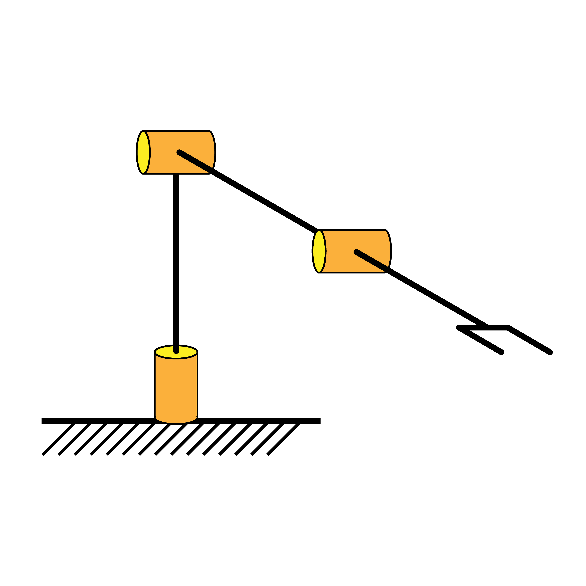

.. DE3 Robotics Coursework documentation master file, created by
   sphinx-quickstart on Wed Jan 27 19:02:39 2021.
   You can adapt this file completely to your liking, but it should at least
   contain the root `toctree` directive.

.. toctree::
   :maxdepth: 2
   :caption: Contents:

============
Introduction
============

Intro text here

================================================
Starting the Virtual Machine and Troubleshooting
================================================

Troubleshooting notes here

==================
Forward Kinematics
==================

-------------------------------
Task A: Computing the D-H Table
-------------------------------

text

----------------------------
Task B: Coding the D-H Table
----------------------------

text

------------------------------------
Task C: Computing Forward Kinematics
------------------------------------

text

==================
Inverse Kinematics
==================

-----------------------------------------------
Task D: Checking if a point is in the workspace
-----------------------------------------------

text

----------------------------
Task B: Coding the D-H Table
----------------------------

text

------------------------------------
Task C: Computing Forward Kinematics
------------------------------------

text

=======================
Differential Kinematics
=======================

=============
Robot Control
=============

* :ref:`genindex`
* :ref:`modindex`
* :ref:`search`

.. code-block:: python

    class RobotKineClass():

    def __init__(self,link_lengths):

        self.ROSPublishers = set_joint_publisher()

        self.nj = 3    #number of joints
        self.links = link_lengths    # length of links

        ################################################ TASK 1
        #Define DH table for each link. DH_tab in R^njx4
        #d,theta,a,alpha
        self.DH_tab = np.array([[self.links[0], 0., 0., 0.],
                                [0., 0., 0., pi/2.],
                                [0., 0., self.links[1], 0.],
                                [0., 0., self.links[2], 0.]])
        self.joint_types = 'rrr'	# three revolute joints